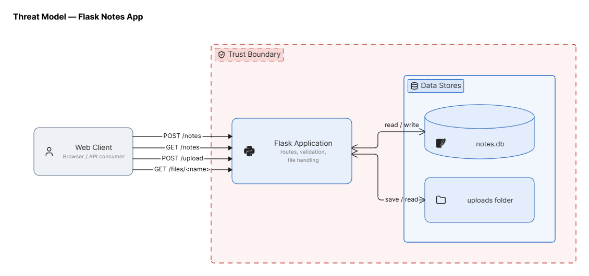

# Threat Model — <app name>

## 1. Data-flow diagram
()

## 2. Elements & trust boundaries
| Element | Type (process/store/entity/flow) | Trust boundary crossed? |
|---|---|---|
| Web client | external entity | yes (Internet → app) |
| Flask app | process |yes (Internet ↔ app and app ↔ data tier)|
| SQLite DB (`notes.db`) | data store |yes (app → data tier)|
| `uploads/` store | data store |yes (app → data tier)|

## 3. STRIDE analysis
| Element | S | T | R | I | D | E |
|---|---|---|---|---|---|---|
| /notes |Yes (accepts owner input without auth)| |Yes (no logging)| | | |
| /upload | |Yes (arbitrary-file-write pass f.filename)|Yes (no logging)|Yes (reveals the path in the response)| | |
| /files/<name> | | |Yes (no logging)|Yes (path-traversal vulnerability with ../)| | |

## 4. Top 5 risks (likelihood × impact) + mitigation
1.
2.
3.
4.
5.
