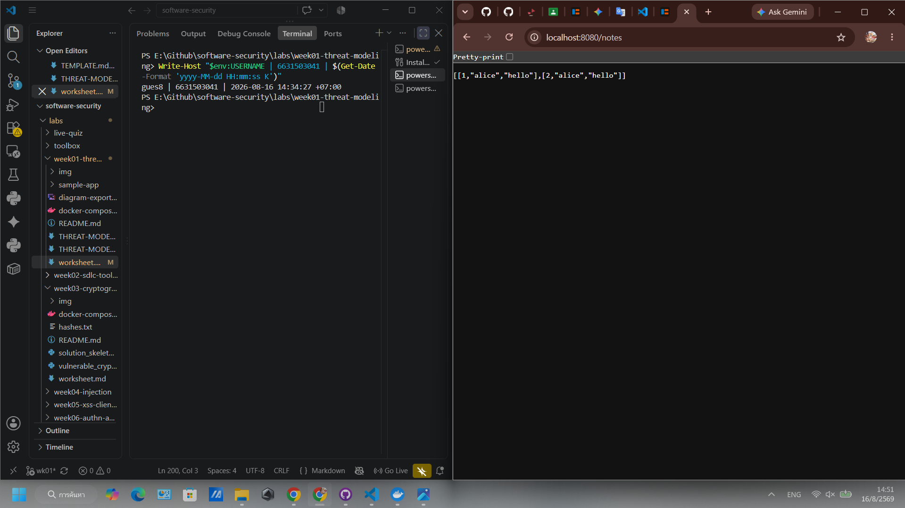

# Worksheet 1 — Security Mindset & Threat Modeling (3 hrs)

> **Course:** Software Security (KOSEN69) · **Week 1**
> **Aligned to:** OWASP 2025 A06 Insecure Design · CWE-501 (Trust Boundary Violation)
> **Signature game:** "Elevation of Privilege" (Microsoft STRIDE card deck)

> **Ethics note:** This week is *modeling only* — you analyze design, you do **not** attack the app. Run the sample app only on your own VM/localhost. Never apply these techniques to systems you do not own or lack written permission to test.

## Part 1 — Student Information
| Name | Student ID | Date | Group |
|---|---|---|---|
|Siravit Thakaew|6631503041|15/08/2026| |

## Part 2 — Lecture Questions
Answer in your own words (2–4 sentences each).
1. Define the CIA triad and give one concrete failure example for each of the three properties.
    The basic framework of information security consists of three main characteristics: confidentiality, integrity, and availability.
2. What is a *trust boundary*, and why does data crossing one deserve extra scrutiny?
    A conceptual boundary that separates systems with different levels of security or reliability. When data crosses this boundary, it moves from one area to another with varying levels of control, thus requiring special verification.
3. Explain "attack surface." Name two things that increase it in a web app.
    1.Opening too many APIs: Having unused or unsecured API endpoints provides hackers with easy opportunities for exploitation and system breaches.
    2.Using third-party libraries: Installing outdated or unupdated code, plugins, or libraries unknowingly introduces new vulnerabilities to web applications.
4. What does each STRIDE letter map to, and which security property does each threat violate?
    S - Spoofing
    Threat: Pretending to be someone or something else (like using a stolen password).
    Violated Property: Authentication (verifying identity).
    T - Tampering
    Threat: Modifying data, files, or code without authorization.
    Violated Property: Integrity (ensuring data is accurate and unchanged).
    R - Repudiation
    Threat: Denying that you performed an action or transaction, while the system cannot prove otherwise.
    Violated Property: Non-repudiation (proof that an action happened).
    I - Information Disclosure
    Threat: Exposing private or sensitive data to people who should not see it.
    Violated Property: Confidentiality (keeping data secret).
    D - Denial of Service
    Threat: Crashing a system or overwhelming it so real users cannot access it.
    Violated Property: Availability (ensuring systems work when needed).
    E - Elevation of Privilege
    Threat: Gaining admin rights or higher access levels than you should have.
    Violated Property: Authorization (controlling permissions and access levels).
5. What does "Secure by Design" (CISA) mean, and how does it differ from bolting security on after release?
    building security into a product's architecture from the very beginning so that protection is a core foundation rather than a late addition.
    Built-in security uses fundamental layers like memory-safe languages and strict data access controls. Bolted-on security tries to wrap an insecure core with external shields.

## Part 3 — Hands-on Lab (180 min)
**Learning goals:** build a data-flow diagram (DFD), apply STRIDE to a real Flask app, rank risks, and propose mitigations.
**Prerequisites:** Docker + Docker Compose in your VM; a drawing tool (draw.io / paper + photo); the Elevation of Privilege deck (print or virtual) — free print-and-play PDF at [github.com/adamshostack/eop](https://github.com/adamshostack/eop).

**Environment setup**
```bash
cd labs/week01-threat-modeling
docker compose up --build           # starts sample-app on http://localhost:8080
curl -s -X POST localhost:8080/notes -H 'Content-Type: application/json' \
     -d '{"owner":"alice","body":"hello"}'   # observe behavior, do not attack
curl -s localhost:8080/notes

echo "demo file" > demo.txt
curl -s -X POST localhost:8080/upload -F "file=@demo.txt"   # observe behavior, do not attack
curl -s localhost:8080/files/demo.txt
```

Source to model lives in `sample-app/app.py`. Template to fill: `THREAT-MODEL-TEMPLATE.md` (copy it, do not edit the original).

**What to submit per task:** the threat/element identified + a screenshot (DFD, table, or running app) + a 2–3 sentence mitigation.

**Task 0 — Onboarding (5 min)** · *Goal:* prove the environment works. *Steps:* `docker compose up`, hit `/notes` and `/files/<name>`, read `sample-app/app.py`. *Deliverable:* screenshot of the running app + the JSON response.


**Task 1 — Draw the DFD (25 min)** · *Goal:* map the system. *Steps:* identify the external entity (web client), the process (Flask app), the data store (`notes.db` SQLite), the `uploads/` store, and the flows for `/notes`, `/upload`, `/files/<name>`; mark the Internet→app trust boundary with a dashed line. *Deliverable:* DFD image embedded in your copy of the template.


**Task 2 — STRIDE the elements (30 min)** · *Goal:* enumerate threats per element. *Steps:* for each element fill the S/T/R/I/D/E grid. Ground it in real code: `/notes` accepts a client-supplied `owner` with no auth (Spoofing); `/upload` saves raw `f.filename` — arbitrary-file-write (Tampering) — and echoes the resolved save path back in its response (Information disclosure); `/files/<name>` reads it back but is comparatively defended (see Task 5); no logging anywhere (Repudiation). *Deliverable:* completed STRIDE table.
| Element | S | T | R | I | D | E |
|---|---|---|---|---|---|---|
| /notes |Yes (accepts owner input without auth)| |Yes (no logging)| | | |
| /upload | |Yes (arbitrary-file-write pass f.filename)|Yes (no logging)|Yes (reveals the path in the response)| | |
| /files/<name> | | |Yes (no logging)|Yes (path-traversal vulnerability with ../)| | |

**Task 3 — Elevation of Privilege game (20 min)** · *Goal:* find threats you missed. *Steps:* play the EoP deck against your DFD; each card you can tie to a real element/flow scores a point; record every valid threat. No printer or scissors? Draw from the digital deck below instead — same 78 cards, same rule. *Deliverable:* list of carded threats + score.

```sim
eop-deck
```
Card 1: R — Repudiation (You've invented a new Repudiation attack)Element / Flow: Flask Application (All Endpoints: /notes, /upload, /files/<name>)
Applies to system? Yes (+1 Point)
Threat Description: The application currently lacks any form of logging, auditing, or session tracking. An attacker can interact with the system (e.g., uploading a malicious payload or creating a fake note) without leaving an identifiable trace such as an IP address or user ID. This means any action can be completely repudiated (denied) by the attacker, as the system has no proof of who performed it. 

Card 2: S — Spoofing (Your system ships with a default admin password, and doesn't force a change)
Element / Flow: N/A
Applies to system? No (0 Points)
Threat Description: This threat does not map to the current architecture. The sample application does not implement any authentication mechanisms, user roles, or passwords (default or otherwise).

Card 3: S — Spoofing (An attacker could steal credentials stored on the client and reuse them)
Element / Flow: Web Client
Applies to system? No (0 Points)Threat Description: This threat does not apply because the application does not issue or store any credentials (such as session cookies, JWTs, or API keys) on the client side. The endpoints simply accept unauthenticated requests directly. 

**Task 3b — Systems-level pass (25 min) 🔭** · *Goal:* find what the per-element grid cannot see. Tasks 2 and 3 enumerate threats **one element at a time**, and that is exactly where threat models are known to stop short — students taught STRIDE alone reliably identify component threats and *discount system-level ones* ([Joshi et al., ASEE 2024](https://arxiv.org/abs/2404.16632)). So do a second pass over the **whole** diagram:


- **Trust boundaries end-to-end.** Follow one request from the client to `notes.db` and back. List every boundary it crosses. Which crossing has no check on it?
- **Assume one element is fully owned.** Pick the Flask process, then the `uploads/` store. For each: what does the attacker now *reach* — not what is it, but where does it get them?
- **Chain two "low" findings.** Find two threats you or the EoP deck rated minor that combine into something you would not accept. Write the chain as `A → B → consequence`.
- **One-line system claim.** Finish: "Even if every element-level mitigation in Task 8 is implemented, this system still fails if ___."

1. Trust boundaries end-to-end (List of boundaries and points without checks): The data transmission path (Request) from the client to the database and back, crossing trust boundaries as follows: Crossing Boundary 1: From the Web Client (Public Internet) to the Flask App (Application Tier). Crossing Boundary 2: From the Flask App (Application Tier) to notes.db and uploads/ (Data Tier). Return: From the Data Tier, cross back to the Application Tier and then back to the Public Internet. Which crossing has no check on it? (Points without checks): Boundary 1 (Internet $\to$ App) has no checks because there is no authentication system. This allows anyone on the internet to instantly bypass the API. Furthermore, the second tier (App $\to$ Data) does not filter filenames before writing to Data Tier 
2. Assume one element is fully owned (Reachability impact when compromised): If a Flask process is compromised: The attacker can reach the entire file system and resources of the server (OS level), read, modify, or delete the notes.db database, and may use this process as a central point to access other systems on the internal network. If uploads/store is compromised: The attacker can control the content the application sends back to other users (Reach clients), allowing them to embed malicious code (e.g., malware or stored XSS) to attack victims accessing the files. 
3. Chain two "low" findings (Chain risk in one path): Chain: Information Disclosure (the system reflects the path location where files are saved back to /upload) $\to$ Tampering (the attacker uses path traversal techniques with ../ to write files outside the folder) $\to$ Consequence: The attacker uses the leaked path to calculate the location of system files. Then, malicious scripts can be uploaded to overwrite the app.py file or database files, resulting in remote code execution or a permanent system crash (denial of service). 
4. One-line system claim (summarizing system-level vulnerabilities): "Even if every element-level mitigation in Task 8 is implemented, this system still fails if there is no system-wide identity/authentication layer and no strict isolation between untrusted user uploads and the application's execution environment."

Use the simulation below before you start — toggle a component to attacker-controlled and watch what it reaches:

```sim
trust-boundary
```

*Deliverable:* the boundary list, two owned-element reachability notes, one written chain, and the system claim.

**Task 4 — Abuse cases & attacker personas (20 min)** · *Goal:* think like specific adversaries. *Steps:* define 2 personas (e.g. a curious logged-in user; an anonymous internet attacker) and write 2 abuse cases each against the sample app, tied to DFD elements. *Deliverable:* 4 abuse cases.
Persona 1: "The Curious User" 
Characteristics: A typical application user or student on the same network who doesn't have malicious intent to damage the server, but is mischievous and likes to experiment with different parameters on their browser to see if the system allows them to do things beyond their permissions. 
Abuse Case 1: Spoofing 
Goal: To create fake posts in someone else's name (e.g., an admin or friend). 
DFD Elements Involved: Web Client $\to$ POST /notes $\to$ Flask Application $\to$ notes.db Method (The Attack): The user modifies the payload in the HTTP request sent to POST /notes by changing the 'owner' field to another person's name, as the system lacks authentication. The application then immediately saves the fake information to notes.db. 
Abuse Case 2: System File Spying (Information Disclosure) 
Goal: To find out what hidden files are on the server besides the uploaded files. 
DFD Elements Involved: Web Client $\to$ GET /files/<name> $\to$ Flask Application $\to$ uploads folder 
Method (The Attack): The user sends a GET request to /files/../../etc/passwd (Path Traversal) to trick the Flask Application into backtracking from the uploads folder, bypassing the boundaries to read the operating system's password file, and then displaying the results on the screen.

Persona 2: "The External Saboteur" (External Attacker/Hacker) 
Characteristics: A malicious attacker from the public internet aiming to take over a system, destroy sensitive data, or crash applications to the point of rendering them unusable. 
Abuse Case 3: Database Tampering (Data Destruction) 
Goal: To destroy a database to render the system unusable or to delete evidence. 
DFD Elements Involved: Web Client $\to$ POST /upload $\to$ Flask Application $\to$ notes.db 
Method (The Attack): The hacker exploits an arbitrary-file-write vulnerability by naming the malware file or an empty file... ../../notes.db is then sent via POST /upload. The application overwrites the actual notes.db database in the Data Store with this file, resulting in the loss of all data for everyone. 
Abuse Case 4: Denial of Service (DoS) 
Goal: To crash the server and cut off access for legitimate users. 
DFD Elements Involved: Web Client $\to$ POST /upload $\to$ Flask Application $\to$ uploads folder 
Method (The Attack): Hackers write an automated script (bot) to repeatedly send requests to POST /upload, continuously uploading very large junk files. Because the application has no file size limits, the storage space in the uploads folder fills up quickly, causing the system to crash and become unable to accept any further commands.

**Task 5 — Path-traversal deep-dive (25 min)** · *Goal:* analyze the riskiest flow. *Steps:* trace `/upload` → `/files/<name>`; explain how `../` in a filename escapes `uploads/`; sketch the secure design (`secure_filename`, store outside web root, allow-list extensions). *Deliverable:* the data flow + secure-design note.
1. The Data Flow: The most dangerous path arises from the interaction of two endpoints as follows: 
Step 1 (Upload): The web client sends an HTTP POST request to /upload with an attached file named maliciously (e.g., filename="../../../etc/passwd"). The Flask application receives the file and appends its name directly to the server's path, then saves the file to the system (data store). 
Step 2 (Read): The web client sends an HTTP GET request to /files/../../../etc/passwd. The Flask application searches for the filename from the URL, retrieves the file from the system, and sends it back to the web client. (Information Disclosure) 
2. How ../ in a filename escapes uploads: In most operating systems, the ../ character (dot-dot-slash) means "go back to a higher level folder" (parent directory).
When an application takes parameters sent by the user... By accessing a file folder without verification, such as creating a path like /app/uploads/ + ../../etc/passwd, the operating system will reinterpret (resolve) that path, backtracking from the uploads/ and app/ folders until it reaches the root of the server, where it can retrieve the etc/passwd password file. This allows the attacker to successfully escape the sandbox. 
3. Secure-Design Note: To prevent this vulnerability at the architectural level (Secure by Design), the following measures should be used in combination: 
Sanitize input with secure_filename(): Never trust the filename submitted by the user. Use functions like secure_filename() instead. Use `werkzeug.utils.secure_filename()` to remove special characters and `../` before using them to create the path, or switch to a new random filename system (e.g., UUID) and store the original filename in the database instead. 
Store files outside the web root: Move the `uploads/` folder outside the area directly accessible to the web server (outside the public directory) to prevent hackers from running scripts that are secretly uploaded via the URL. 
Allow-list extensions: Check file extensions using an "allow-list" system, such as accepting only .txt, .jpg, and .png. Avoid using a "block-list" system as it often doesn't cover all dangerous files (e.g., .py, .sh, .php).

**Task 6 — Threat-model the project target (30 min)** · *Goal:* kick off your term project. *Steps:* stop the sample-app first (`docker compose down` — both apps bind host port 8080), then run **NoteVault** (`cd ../../project/starter-app && docker compose up`), draw a quick DFD, and list the top 3 STRIDE threats you'd investigate. *Deliverable:* NoteVault DFD + top-3 threats (reuse these in your project report — `project/REPORT-TEMPLATE.md` in the repo root).

**Task 7 — Security requirements (15 min)** · *Goal:* turn threats into testable requirements. *Steps:* write 3 security requirements as acceptance criteria ("the system must … so that …"), each mapped to a threat from Task 2 or Task 6. *Deliverable:* 3 testable security requirements.

**Task 8 — Defend / fix it: rank & mitigate (25 min) 🛡️** · *Goal:* turn threats into action you can prove. *Steps:* rank the top 5 threats by likelihood × impact; propose one concrete mitigation each (e.g., auth on `/notes`, `secure_filename()` + allowlist for `/upload`, request logging for Repudiation, size/rate limits for DoS). Then **pick one and actually implement it** in your fork.

*Deliverable — the top-5 table, plus for the one you implemented:*
1. the **diff** (commit hash on your `wk01` branch),
2. **evidence it works**: the request that succeeded before your change and is refused after — both outputs,
3. **why it closes the class, not the instance** (2–3 sentences). `secure_filename()` on one endpoint is an instance fix; *"no user-supplied string ever becomes a path component"* is a class fix. Say which yours is, and if it's an instance fix, say what the class fix would be.

> **Why this is weighted.** Fewer than half of working developers can spot a security hole in code, and being shown vulnerabilities does not by itself teach you to find or close them. Exploiting is the half that feels like progress; defending is the half that transfers to your job.

## Part 4 — Reflection
1. Map your top finding to a CWE and to OWASP A06 (Insecure Design); explain the mapping in one sentence.
    Arbitrary File Write/Path Traversal vulnerability is associated with CWE-501 (Trust Boundary Violation) or CWE-22 and is listed under OWASP A06 (Insecure Design).
    This attack occurs because the application has a design flaw from the outset, allowing untrusted filename data to bypass security boundaries and enter the data tier without any mechanism for data verification or sanitization.
2. Name one real-world breach caused by a design flaw (not a missing patch) and what design control would have prevented it.
    Real-world breach: The 2019 data breach at First American Financial (leading to over 885 million sensitive documents) resulted from a design flaw in the Insecure Direct Object Reference (IDOR) category. This flaw allowed anyone to access another person's document simply by changing the ID number in the URL.

    Prevention (Design control): This can be prevented by implementing Mandatory Access Control. The system must always verify that the user making the request has the necessary authorization to access the document with that specific ID before sending the file.
3. Of your five mitigations, which gives the most risk reduction per unit of effort, and why?
    The most cost-effective method: Using the secure_filename() function in conjunction with a random filename (e.g., UUID) in the upload system.

    Because it requires very low implementation effort (adding only a few lines of code and calling existing libraries) but provides a very high level of risk reduction. This is because it's a class fix that blocks both path traversal and the uploading of malicious files to overwrite system files simultaneously.

## Grading rubric (100)
| Criterion | Points |
|---|---|
| Lecture questions (Part 2) | 20 |
| Exploitation + evidence (DFD + STRIDE table + EoP findings + screenshots) | 40 |
| Defense (top-5 ranking + mitigations) | 25 |
| Reflection (CWE/OWASP mapping + breach + best mitigation) | 15 |

**Assessed within the rows above** (they are not extra points — they are what those points are for):
- **Systems-level reasoning** (inside *Exploitation + evidence*, Task 3b): does the model reach past single elements to boundaries, reachability and chains? Scored with the STRIDE + systems-thinking rubrics of [Joshi et al. 2024](https://arxiv.org/abs/2404.16632).
- **Defensive proof** (inside *Defense*, Task 8): a claimed mitigation with no before/after evidence scores at most half. A mitigation you can show closing a *class* scores full.
- **Adversarial thinking** (across the whole sheet): do the abuse cases, personas and chains show you reasoning as an attacker with goals and constraints — or just listing categories? This is the course's central disposition and it is assessed, not assumed.

---

## Evidence & Integrity (required)

- **Identity proof:** every screenshot/diagram must show a terminal running `printf '%s | %s | ' "$(whoami)" '<YOUR-STUDENT-ID>'; date '+%F %T %Z'` **in the
  same image as the evidence**. When the evidence is a browser page, a DevTools panel or a
  rendered response, put that terminal **beside the browser and capture the whole screen** — a
  cropped window carries nothing that identifies you, and the lab's own output is
  byte-identical for the whole cohort *by design*, so the stamp is the only thing that makes
  the shot yours. Generic or borrowed evidence is not accepted.
  
  
- **Personalized flag (if this lab issues one):** ____________________
  *Flags are unique per student — submitting another student's flag is a violation. How to submit: **learn.zcr.ai/submit** (full guide: `SUBMISSION.md` in the repo root).*
- **Explain in your own words** *(graded on your reasoning, not copied text):*
  1. What did you do, and **why did the vulnerability work**?
    What I did: I simulated an attack through the /upload (or /files/) path by appending a filename containing the characters ../ such as ../../../etc/passwd or ../notes.db. Why the vulnerability works: This vulnerability works because the application lacks validation for data that crosses the Trust Boundary. The system code appends the filename (f.filename or <name>) submitted by the user directly to the server path. When the operating system encounters the characters ../, it interprets it as "going back one folder," allowing the file to be saved or read through the defined uploads/ folder boundaries and access system files or databases.
  2. **Why does your fix actually stop it** — and what could still break it?
    Why the fix works: I fixed it by adding a secure_filename() function (or a new filename) to filter the data before use. This function removes or replaces special characters such as /, \, and .. from all filenames. This ensures that no matter how many ../ files an attacker sends, they will be converted to plain names (e.g., .._.._etc_passwd), confining the files only to the uploads/ folder. This is a definitive class fix for Path Traversal. However, edge cases where the system could still be compromised are: even if the folder cannot be bypassed, if the system doesn't have a file extension allow-list, attackers can still upload malicious script files (e.g., .php, .py, or .html) to the server. Furthermore, without authentication and file size limits, attackers can continue uploading files until the server's storage is full (Denial of Service).
  

---

## 🤖 Audit the AI (required)

AI is a power tool you must **distrust** — you are graded on your *critique*, not the AI's answer.

1. Ask an AI assistant to exploit **or** fix this week's vulnerability. Paste its full answer.
2. **Find what's wrong or risky** in it — insecure code, a subtly incomplete fix, a hallucinated API/function/CVE, a missed edge case, or wrong reasoning. Quote the exact line(s).
3. Produce the **correct, verified** version yourself and explain in 2–3 sentences why the AI's output was insufficient.
    

> Disclose your AI use in the Part 1 table. This task counts toward your **Defense + Reflection** score.

---

## 🧠 Comprehension & Prompt (required)

**A. Explain in Plain English (EiPE).** In 2–3 sentences, in your own words, describe what this week's vulnerable code/endpoint actually *does* and *why it is exploitable* — explain the mechanism, don't dump jargon.

**B. Prompt Problem.** Write a **single prompt** that makes an AI produce a *correct, secure* fix for one finding. Run it: does the exploit now fail? If not, refine the prompt and try again. Submit the **final prompt + the verified result**.
*Graded on the prompt's precision and your verification — this trains problem decomposition and AI literacy (Denny et al. 2024).*
