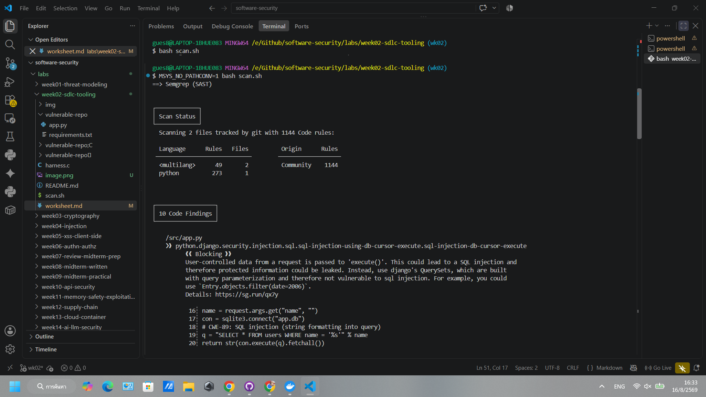
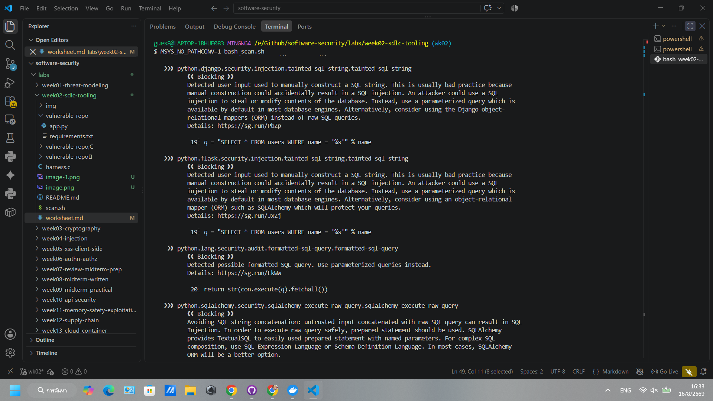
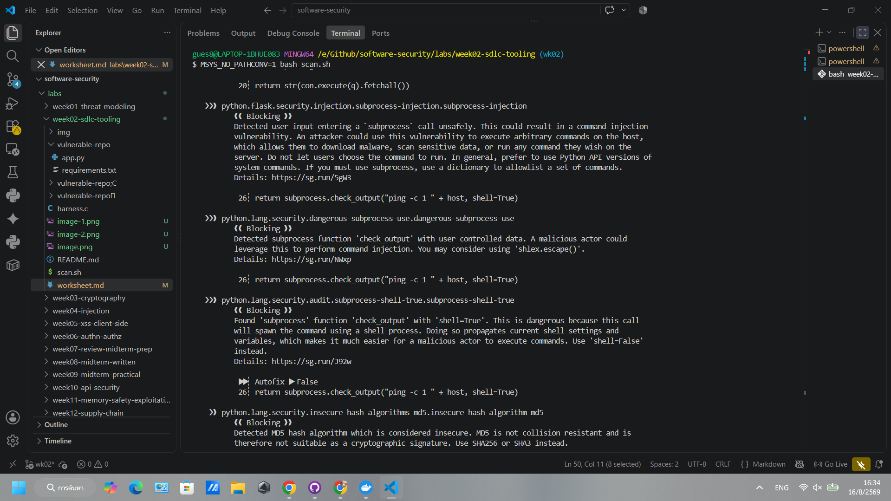
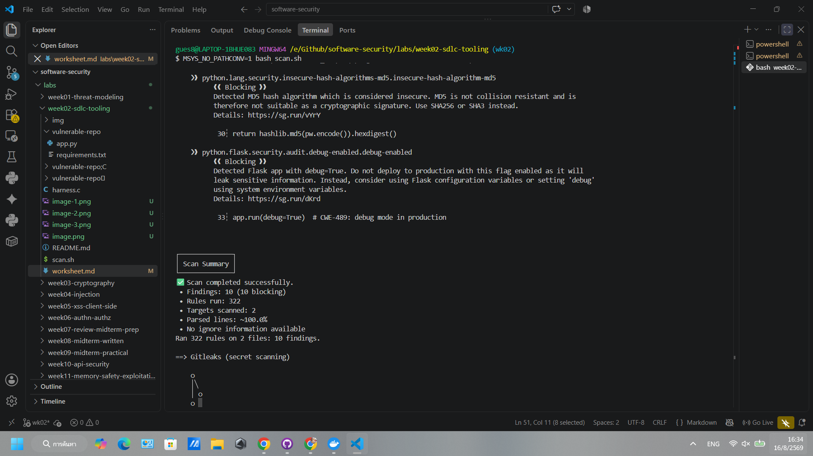
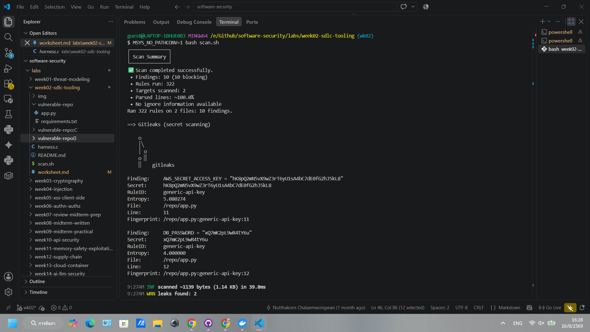

# Worksheet 2 — Secure SDLC & Tooling (3 hrs)

> **Course:** Software Security (KOSEN69) · **Week 2**
> **Aligned to:** OWASP 2025 (A05 Injection [CWE-89, CWE-78], A04 Cryptographic Failures [CWE-327], A02 Security Misconfiguration [CWE-798, CWE-489]) · CWE-798, CWE-89, CWE-78, CWE-327, CWE-489
> **Signature game:** "Bug Triage Race" (scan → triage; score = true positives − misclassified)

> **Ethics note:** The scanners run only against the provided `vulnerable-repo/` on your own machine. Do not point SAST/secret scanners at third-party repos or production systems without authorization. Treat any secret you find here as fake lab data.

## Part 1 — Student Information
| Name | Student ID | Date | Group |
|---|---|---|---|
|Siravit Thakaew|6631503041|16/08/2026| |

## Part 2 — Lecture Questions
Answer in your own words (2–4 sentences each).
1. Distinguish SAST, DAST, and SCA — what does each see, and when in the SDLC does each run?
  SAST (Static Application Security Testing): Analyzes the static source code structure to find vulnerabilities. It's typically run during code writing or before code commitment. 
  DAST (Dynamic Application Security Testing): Does not see the source code but simulates attacks on a running application to observe its response. This tool is used during deployment or the testing phase. 
  SCA (Software Composition Analysis): Checks external libraries or dependencies used by the project for known vulnerabilities. This is generally run during the code build process.
2. What is secret scanning, and why do hardcoded secrets keep ending up in repos?
  Secret scanning is the process of finding confidential information that has slipped into source code, such as API keys, passwords, or tokens (for example, the Gitleaks tool). This is usually done during the commit phase. 
  The reason confidential information often ends up in the repository is because during development, developers often embed hardcoded credentials directly into the code for quick application execution and testing (e.g., in the app.py file) and frequently forget to remove them or change to environment variables before committing the code.
3. What does "shift-left / DevSecOps" mean in practice for a CI pipeline?
  The term "shift-left" refers to moving the security auditing process to the left (beginning) of the software development lifecycle as quickly as possible. In practice for a CI pipeline, this means automating this process, such as configuring SAST, SCA, and Secret scanning to run immediately upon code introduction (e.g., during a pull request) and automatically failing the pipeline if a high-level (critical) vulnerability is detected, preventing problematic code from reaching production.
4. Why is coverage-guided fuzzing considered the dominant modern bug-finding technique?
  Coverage-guided fuzzing is a highly effective technique because it doesn't blindly send junk data. Instead, it works by tracking the program's execution path (code coverage). If it finds that a particular input leads to execution of new code blocks, it mutates that input to delve deeper. This method allows the fuzzer to automatically discover complex bugs, such as heap-buffer-overflow issues—types of vulnerabilities that SAST pattern scanning tools often miss.
5. Define true positive vs. false positive in scanner triage, and why misclassifying both directions is costly.
  A true positive is when the scanning tool detects a vulnerability that is genuine and functional. A false positive, on the other hand, is when the tool reports a vulnerability but the code is not actually problematic. Incorrect triage comes at a high price. If you incorrectly identify a true positive as false, your system will be left vulnerable and at risk of hacking. Conversely, if you incorrectly identify a false positive, your development team will waste valuable time and resources fixing code that wasn't problematic in the first place.


## Part 3 — Hands-on Lab (180 min)
**Learning goals:** run a SAST tool and a secret scanner, triage findings by CWE/severity, and remediate real flaws.
**Prerequisites:** Docker installed; internet to pull the Semgrep/Gitleaks images.

**Environment setup**
```bash
cd labs/week02-sdlc-tooling
cat scan.sh                 # see exactly what it runs
bash scan.sh                # Semgrep (p/default + p/owasp-top-ten) then Gitleaks on ./vulnerable-repo
```
Target under scan: `vulnerable-repo/app.py` (plus `requirements.txt`). It contains five planted flaws.

**What to submit per task:** the command/payload run + a screenshot of the finding + a 2–3 sentence mitigation.

**Task 0 — Onboarding (5 min)** · *Goal:* confirm tooling. *Steps:* run `bash scan.sh`; confirm both Semgrep and Gitleaks sections produce output. *Deliverable:* screenshot showing both tools ran.

**Task 1 — SAST sweep with Semgrep (25 min)** · *Goal:* find code flaws. *Steps:* read the Semgrep output; locate the SQL injection in `/user` (CWE-89, string-formatted query), the OS command injection in `/ping` (CWE-78, `shell=True`), the weak `md5` password hash (CWE-327), and `debug=True` (CWE-489). *Deliverable:* one screenshot per finding with the file:line.




**Task 2 — Secret scan with Gitleaks (15 min)** · *Goal:* find leaked credentials. *Steps:* read the Gitleaks output; identify `AWS_SECRET_ACCESS_KEY` and `DB_PASSWORD` (CWE-798). *Deliverable:* screenshot + the rule that fired for each.


**Task 3 — Bug Triage Race (30 min)** · *Goal:* triage accurately. *Steps:* build a table with columns *Tool | File:Line | CWE | Severity | TP/FP | Fix idea*; mark at least 3 true positives and 1 likely false positive and justify each. (Score = TP − misclassified.) *Deliverable:* the completed triage table.

**Completed triage:**

| Tool | File:Line | CWE | Severity | TP/FP | Fix idea |
|---|---|---|---|---|---|
| Semgrep | `vulnerable-repo/app.py:19` | CWE-89 | High | TP | Use `?` parameter binding instead of string formatting. |
| Semgrep | `vulnerable-repo/app.py:26` | CWE-78 | High | TP | Pass `['ping', '-c', '1', host]` as an argument list and avoid `shell=True`. |
| Semgrep | `vulnerable-repo/app.py:30` | CWE-327 | High | TP | Use bcrypt or Argon2 with a per-password salt. |
| Semgrep | `vulnerable-repo/app.py:33` | CWE-489 | Medium | TP | Set `debug=False` outside local development. |
| Gitleaks (`generic-api-key`) | `vulnerable-repo/app.py:11` | CWE-798 | High | TP | Remove it from source/history, rotate it, and load it from a secret manager. |
| Gitleaks (`generic-api-key`) | `vulnerable-repo/app.py:12` | CWE-798 | High | Likely FP for production, TP for the exercise | The value is fake lab data, but it is still hardcoded and actionable in the exercise. |

The Semgrep findings are true positives because attacker-controlled input reaches a SQL query or shell command, MD5 is unsuitable for password storage, and Flask debug mode can expose a debugger. The Gitleaks rule is generic and cannot prove that a credential is live, so it can be a false positive in ordinary triage; here the worksheet explicitly plants the values and asks for remediation.

**Task 4 — Fuzzing intro (10 min)** · *Goal:* see coverage-guided fuzzing find a bug SAST won't. *Steps:* in the `labs/toolbox` container (Apple clang has no libFuzzer runtime), build `clang -g -fsanitize=address,fuzzer harness.c -o fuzz`, then **seed the corpus** and run it:
`mkdir -p corpus && printf 'FUZ' > corpus/seed && ./fuzz corpus`. It crashes almost immediately with an AddressSanitizer heap-buffer-overflow at `harness.c:23` (the `data[3]` read with no `size > 3` check). Seeding matters: an unseeded `./fuzz` has to rediscover the magic bytes by chance and often finds nothing for minutes — that unpredictability is itself worth a sentence in your write-up. (The deep fuzzing+exploit lab is Week 11.) *Deliverable:* the ASan crash output (or a screenshot) + a 2-sentence note on why fuzzing finds this bug when a linter/SAST pass over the same 4-line check would not.

**Completed result:** The seeded input reaches the nested `F`, `U`, `Z` checks and the unsafe `data[3]` read with only three bytes available. AddressSanitizer reports a heap-buffer-overflow at `harness.c:23`; coverage-guided mutation reaches this path, while a pattern-based linter may not infer the missing size check at that control-flow point.

**Task 5 — Scan the project target (40 min)** · *Goal:* apply the tools to your term project. *Steps:* run Semgrep + Gitleaks against **NoteVault** (`../../project/starter-app`); also run an SCA scan: `docker run --rm -v "$PWD/../../project/starter-app:/src" aquasec/trivy fs /src`. *Deliverable:* a findings list (tool, file:line/CVE, CWE) — reuse it in your project vuln report.

**Completed findings:**

| Tool | Location | Finding / CWE |
|---|---|---|
| Semgrep | `project/starter-app/app.py:68-69,117,129` | MD5 password hashing, CWE-327, High. |
| Semgrep | `project/starter-app/app.py:83` | JWT configuration accepts `none`, CWE-347, High. |
| Semgrep | `project/starter-app/app.py:126-130` | SQL query built with string formatting, CWE-89, High. |
| Semgrep | `project/starter-app/app.py:181-202` | User input reaches `shell=True`, CWE-78, High. |
| Semgrep | `project/starter-app/app.py:23`, `Dockerfile:5` | Hardcoded application secret, CWE-798, High. |
| Semgrep | `project/starter-app/app.py:19` | User content rendered with `|safe`, CWE-79, High. |
| Trivy | `requirements.txt` | `CVE-2021-33503` in urllib3 1.26.4, High; upgrade urllib3. |
| Trivy | `requirements.txt` | `CVE-2023-32681` in requests 2.25.1, Medium; upgrade requests. |
| Trivy | `requirements.txt` | Werkzeug advisories including `CVE-2023-25577` and `CVE-2024-34069`; upgrade Flask/Werkzeug together. |

Gitleaks reported no live secret in the direct NoteVault scan; the hardcoded `SECRET` was nevertheless identified by SAST and must be injected at deployment. Trivy output is time-sensitive, so re-run it immediately before submission.

**Task 6 — Build a security CI gate (25 min)** · *Goal:* automate the scan (previews Week 15). *Steps:* adapt `../week15-devsecops-pipeline/security-ci.yml` into a workflow that runs Semgrep + Trivy + Gitleaks and **fails on HIGH/CRITICAL**; run it locally (`act`) or commit to your fork and read the Actions log. *Deliverable:* the workflow file + a screenshot of a failing run.

**Completed result:** The adapted workflow is `security-ci.yml` in this lab directory. Semgrep uses `--error`, Trivy gates HIGH/CRITICAL with `exit-code: "1"`, and Gitleaks uses `--exit-code 1`, so planted findings fail the gate while report steps can still upload SARIF.

**Task 7 — SAST blind spots (20 min)** · *Goal:* see what scanners miss. *Steps:* find one real bug in `vulnerable-repo/app.py` (or NoteVault) that Semgrep did **not** flag, and explain why a pattern-based tool missed it. *Deliverable:* the bug + a 2-sentence explanation.

**Completed result:** Semgrep did not report the hardcoded `AWS_SECRET_ACCESS_KEY` and `DB_PASSWORD` values in `vulnerable-repo/app.py:11-12`; Gitleaks found them instead. SAST generally focuses on code/data-flow patterns and cannot reliably determine whether a high-entropy string is a credential, while secret scanners are built for that signal.

**Task 8 — Defend / fix it (10 min)** · *Goal:* remediate the planted flaws in `vulnerable-repo/app.py`. *Steps:* rewrite `/user` to use a parameterized query (`?` placeholder); remove `shell=True` and pass an argument list in `/ping`; move both secrets to environment variables; replace `md5` with bcrypt/argon2; set `debug=False`. *Deliverable:* a before/after diff for each fix mapped to its CWE.

**Completed result:** The sample app now uses a parameterized SQLite query (CWE-89), passes ping as an argument list without a shell (CWE-78), reads both credentials from environment variables (CWE-798), hashes passwords with bcrypt and a random salt (CWE-327), and runs Flask with `debug=False` (CWE-489). The dependency was added to `vulnerable-repo/requirements.txt`; the before/after diff is the Git diff for these files.

## Part 4 — Reflection
1. Map two of your findings to their CWE and to the matching OWASP 2025 category.

| Finding | CWE Mapping | OWASP Top 10 (2025) Category | Context & Details |
|---|---|---|---|
|Hardcoded API Key / Private Token|CWE-798: Use of Hard-coded Credentials|A04:2025 – Cryptographic Failures|Secrets embedded in plaintext expose signing keys, database credentials, or external service tokens, compromising cryptographic boundaries and authorization controls.|
|SQL Injection (Raw String Concatenation)|CWE-89: Improper Neutralization of Special Elements used in an SQL Command ('SQL Injection')|A05:2025 – Injection|Unsanitized input concatenated directly into database queries allows attackers to bypass authentication, read arbitrary data, or modify database contents.|

2. Name a real-world breach caused by a hardcoded/leaked secret or an injection flaw, and what control would have caught it pre-release.
Breach: Uber (September 2022 Breach)

Root Cause: Hardcoded Privileged Credentials & Secret Leakage.

Incident Summary: An attacker compromised an external contractor's personal device, obtained VPN credentials via MFA fatigue, and gained initial network access. Once inside the internal network, the attacker scanned PowerShell scripts on network shares and discovered hardcoded admin credentials for the Thycotic privileged access management (PAM) platform, granting full administrative access to AWS, Google Workspace, Duo, and Slack.

Pre-Release Controls to Catch It:

Automated Pre-Commit & Secret Scanning: Implementing scanning tools (such as GitGuardian, Trufflehog, or Gitleaks) in pre-commit hooks and CI/CD pull request workflows to detect API keys, plaintext credentials, and high-entropy strings before code merges into repositories or deployment scripts.

Centralized Secrets Management: Storing and retrieving credentials dynamically using secure vault solutions (e.g., HashiCorp Vault, AWS Secrets Manager) via short-lived, rotated tokens rather than hardcoding static credentials in scripts.

3. Which single tool (SAST vs. secret scanning) gave the highest-value findings on this repo, and why?

For codebases containing both static application logic and configuration files, Secret Scanning typically provides the highest actionable value, for several reasons:

Zero-False-Positive High Impact: Secrets identified by secret scanners (e.g., active database connection strings, JWT signing keys, AWS IAM keys) are immediately exploitable with deterministic impact. Remediating a leaked secret (revocation and rotation) requires minimal triage overhead compared to SAST alerts.

SAST Triaging Overhead: While Static Application Security Testing (SAST) covers a broader range of vulnerabilities (e.g., injection, insecure deserialization, path traversal), it often introduces significant noise via false positives on untainted data paths or functions not exposed to external user input.

Speed & Pipeline Placement: Secret scanning runs quickly in pre-commit hooks and PR gates, catching issues before deployment, whereas deep data-flow SAST analysis requires full AST generation and significantly longer pipeline execution times.

For an overview of how the OWASP Top 10 categories evolved and practical advice on securing your development pipeline, check out this walkthrough: OWASP Top 10 2025 Guide. This video is relevant because it explains the specific category updates in the 2025 framework and highlights how automated testing tools address each vulnerability class.

## Grading rubric (100)
| Criterion | Points |
|---|---|
| Lecture questions (Part 2) | 20 |
| Exploitation + evidence (scan output + triage table + screenshots) | 40 |
| Defense (remediated `app.py` with before/after diffs) | 25 |
| Reflection (CWE/OWASP mapping + breach + tool value) | 15 |

---

## Evidence & Integrity (required)

- **Identity proof:** every screenshot/diagram must show a terminal running `printf '%s | %s | ' "$(whoami)" '<YOUR-STUDENT-ID>'; date '+%F %T %Z'` **in the
  same image as the evidence**. When the evidence is a browser page, a DevTools panel or a
  rendered response, put that terminal **beside the browser and capture the whole screen** — a
  cropped window carries nothing that identifies you, and the lab's own output is
  byte-identical for the whole cohort *by design*, so the stamp is the only thing that makes
  the shot yours. Generic or borrowed evidence is not accepted.
- **Personalized flag (if this lab issues one):** ____________________
  *Flags are unique per student — submitting another student's flag is a violation. How to submit: **learn.zcr.ai/submit** (full guide: `SUBMISSION.md` in the repo root).*
- **Explain in your own words** *(graded on your reasoning, not copied text):*
  1. What did you do, and **why did the vulnerability work**?
  2. **Why does your fix actually stop it** — and what could still break it?

---

## 🤖 Audit the AI (required)

AI is a power tool you must **distrust** — you are graded on your *critique*, not the AI's answer.

1. Ask an AI assistant to exploit **or** fix this week's vulnerability. Paste its full answer.
2. **Find what's wrong or risky** in it — insecure code, a subtly incomplete fix, a hallucinated API/function/CVE, a missed edge case, or wrong reasoning. Quote the exact line(s).
3. Produce the **correct, verified** version yourself and explain in 2–3 sentences why the AI's output was insufficient.

> Disclose your AI use in the Part 1 table. This task counts toward your **Defense + Reflection** score.

---

## 🧠 Comprehension & Prompt (required)

**A. Explain in Plain English (EiPE).** In 2–3 sentences, in your own words, describe what this week's vulnerable code/endpoint actually *does* and *why it is exploitable* — explain the mechanism, don't dump jargon.

**B. Prompt Problem.** Write a **single prompt** that makes an AI produce a *correct, secure* fix for one finding. Run it: does the exploit now fail? If not, refine the prompt and try again. Submit the **final prompt + the verified result**.
*Graded on the prompt's precision and your verification — this trains problem decomposition and AI literacy (Denny et al. 2024).*
