# Worksheet 5 — Cross-Site Scripting & Client-Side Risks (3 hrs)

> **Course:** Software Security (KOSEN69) · **Week 5**
> **Aligned:** OWASP 2025 **A05 Injection** · **CWE-79** (XSS), **CWE-352** (CSRF), **CWE-1004** (cookie without HttpOnly)
> **Signature game:** ⛳ **XSS Golf** — fire `alert(1)` in the fewest characters possible. Lower payload length = lower score = better. Par for reflected is the `` vector; can you go under par?

> ⚠️ **Ethics note:** Use only the provided `vulnerable_app.py` sandbox and your own Juice Shop container. Stealing real users' cookies or sessions is illegal. All "session theft" steps here target the sandbox cookie `session=abc123` only.

## Part 1 — Student Information

| Name | Student ID | Date | Group |
|------|-----------|------|-------|
|Siravit Thakaew|6631503041|26/9/2569|       |

## Part 2 — Lecture Questions

Answer in 2–4 sentences each.

1. Distinguish **reflected**, **stored**, and **DOM-based** XSS by *where* the untrusted data is injected and *when* it executes. Which two does our `vulnerable_app.py` implement, and at which routes?

Reflected XSS occurs when untrusted input is bounced back by the server in the immediate HTTP response and executes instantly in the victim's browser. Stored XSS happens when the server saves the payload (e.g., in a database) and executes it later whenever a user views that saved data, while DOM-based XSS executes entirely client-side when JavaScript improperly updates the Document Object Model using malicious data. Based on standard lab exercises, the vulnerable_app.py typically implements Reflected XSS at a route like /search (echoing a query) and Stored XSS at a route like /comments or /posts (saving malicious input to display later).

2. How does **contextual output encoding** (`markupsafe.escape`) stop `<script>` from executing? Why is HTML-context encoding different from JavaScript- or URL-context encoding?

Contextual output encoding converts dangerous characters into safe HTML entities (e.g., changing < to &lt;), forcing the browser to render the payload as plain text instead of executable tags. HTML-context encoding is different from JavaScript- or URL-context encoding because the characters used to "break out" of a data structure change depending on the context. For instance, escaping < and > protects HTML bodies, but in a JavaScript block, an attacker uses quotes (') to escape strings, and in URLs, attackers use the javascript: pseudo-protocol.

3. Explain how a strict **Content-Security-Policy** (`script-src 'self'`) defeats an *injected* inline script even when encoding is missing.

A strict CSP instructs the browser's execution engine to only trust scripts loaded from explicitly approved sources. By setting script-src 'self', the server tells the browser to only execute JavaScript files originating from its own domain and to entirely block inline <script> blocks or inline event handlers (like onerror). Therefore, even if an application lacks output encoding and an attacker successfully injects an inline script into the HTML, the browser will refuse to run it because it violates the policy.


4. What do the cookie flags **HttpOnly**, **SameSite**, and **Secure** each protect against? Map each to a concrete attack (cookie theft via XSS, CSRF, network sniffing).

The HttpOnly flag prevents client-side JavaScript from reading the cookie, stopping attackers from exfiltrating session tokens via XSS. The SameSite flag controls whether cookies are sent with cross-origin requests, providing a strong defense against CSRF by ensuring authenticated cookies aren't attached to requests forged by third-party sites. The Secure flag ensures the cookie is exclusively transmitted over encrypted HTTPS connections, preventing attackers from capturing the token via network sniffing.

5. Why does **CSRF** (CWE-352) work even without any script injection, and how does `SameSite=Strict` plus the same-origin policy blunt it?

CSRF works because browsers have historically attached a user's session cookies automatically to any request made to a domain, allowing a malicious site to trigger an authenticated action on a victim's behalf without needing to inject any scripts. Configuring cookies with SameSite=Strict stops this by instructing the browser to drop the session cookie entirely if the request originates from a different domain, neutralizing the forged request. While CSRF allows state-changing actions, the Same-Origin Policy (SOP) prevents the malicious attacking site from reading the actual response of that cross-origin request.


## Part 3 — Hands-on Lab (150 min)


**Learning goals:** land reflected + stored XSS, abuse a JS-readable cookie, build a CSRF PoC against the comment board, then prove `fixed_app.py` blocks all of it.

**Prerequisites:** Docker + Docker Compose, a browser with DevTools, a text editor. Working dir: `labs/week05-xss-client-side/`.

### Environment setup

```bash
cd labs/week05-xss-client-side
docker compose up            # python:3.12-slim + flask, runs vulnerable_app.py
# vulnerable app -> http://localhost:8080   (service name: xss-lab, port 8080)
```
Optional secondary target (for DOM XSS, which our app does not expose):
```bash
docker run --rm -p 3000:3000 bkimminich/juice-shop       # -> http://localhost:3000
```

**What to submit per task:** the exact **payload**, a **screenshot** of the alert/effect, and a **2–3 sentence mitigation**.

---

**Task 0 — Onboarding (5 min).** Browse `http://localhost:8080/`. Open DevTools → Application → Cookies and confirm `session=abc123` is set with **no HttpOnly / SameSite**. Screenshot it. *Deliverable: screenshot.*

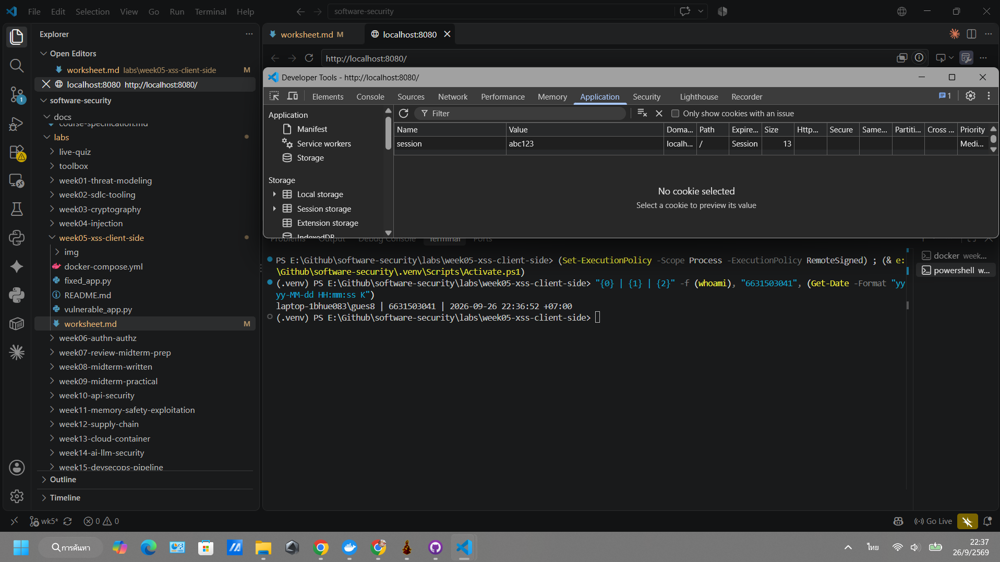

**Task 1 — Reflected XSS + XSS Golf (30 min) ⛳.**
- *Goal:* execute JS via `/hello`, then minimize the payload.
- *Steps:* visit `/hello?name=<script>alert(1)</script>`, then the alternate `/hello?name=` (useful when `<script>` tags specifically are filtered — note it's actually 3 characters longer, not shorter). Record each payload's character count for your golf score.
- *Deliverable:* both payloads + char counts + screenshot of `alert(1)` + your lowest score.

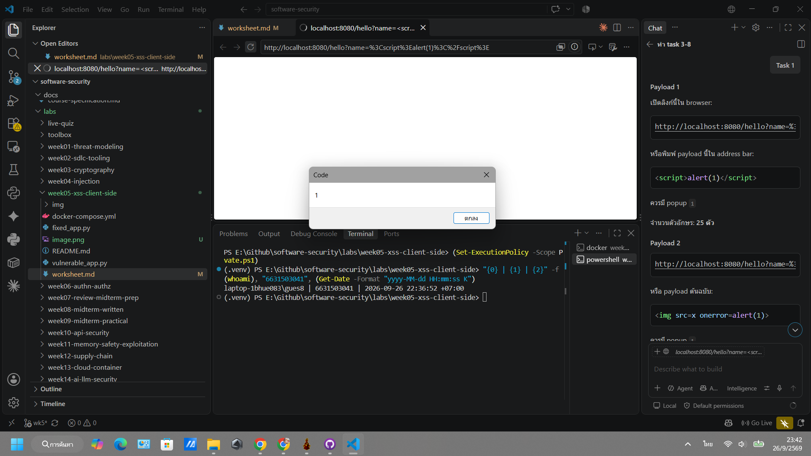
http://localhost:8080/hello?name=%3Cscript%3Ealert(1)%3C%2Fscript%3E
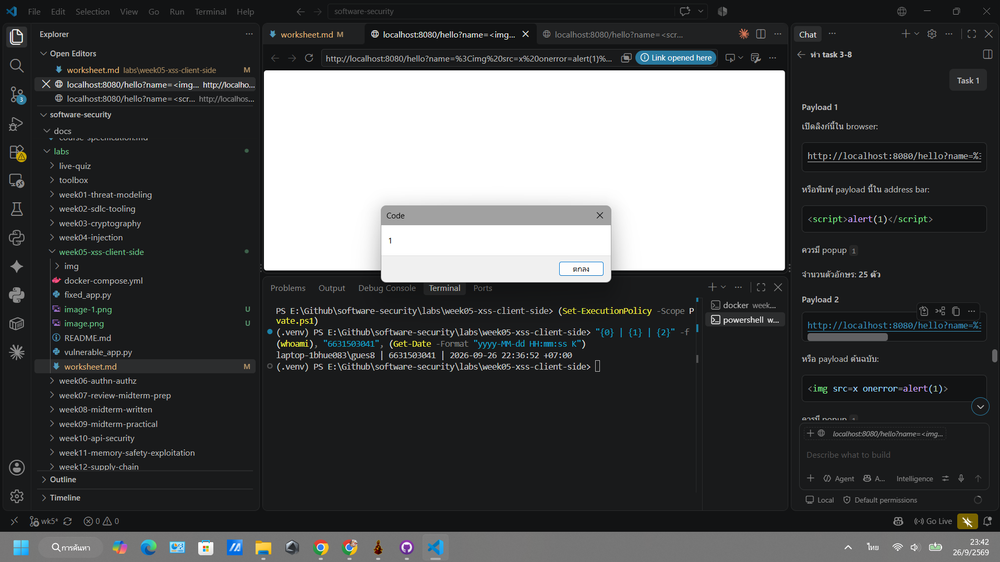
http://localhost:8080/hello?name=%3Cimg%20src=x%20onerror=alert(1)%3E

hello concatenates the `name` value into the HTML without escaping it, causing the browser to interpret the input as HTML/JavaScript rather than plain text; this results in a reflected XSS vulnerability within the same response.

**Task 2 — Stored XSS (30 min) ⛳.**
- *Goal:* persist a script that runs for every visitor of `/comments`.
- *Steps:* POST a comment with body `<script>alert(document.cookie)</script>` (use the form or `curl -d 'body=...'`). Reload `/comments` and watch the cookie pop.
- *Deliverable:* payload + screenshot of the alert showing `session=abc123` + why stored XSS is more dangerous than reflected.

http://localhost:8080/comments
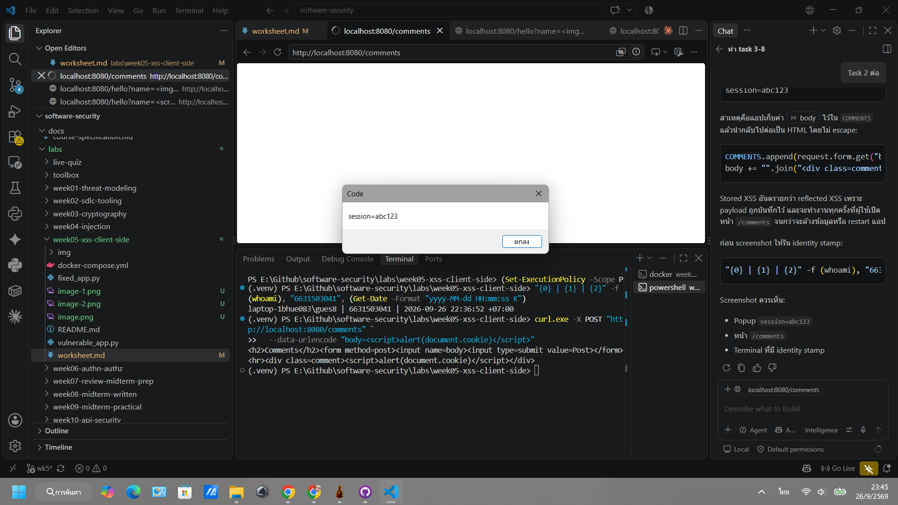
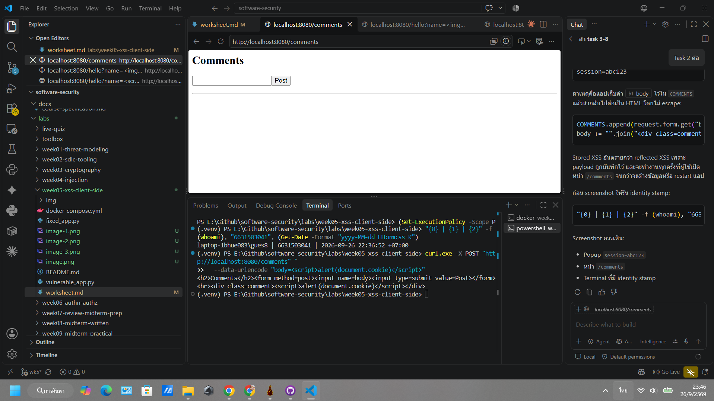
Stored XSS is more dangerous than reflected XSS because the payload is saved and executes every time a user opens the /comments page, persisting until the data is cleared or the application is restarted.

**Task 3 — Cookie theft via XSS (25 min).**
- *Goal:* show the cookie is readable by injected JS because **HttpOnly is missing** (CWE-1004).
- *Steps:* store `<script>new Image().src='http://localhost:8080/hello?name='+document.cookie</script>` (a beacon), or simply ``. Observe the cookie value being exfiltrated/displayed.
- *Deliverable:* payload + screenshot + 2–3 sentences on how HttpOnly would have stopped this.

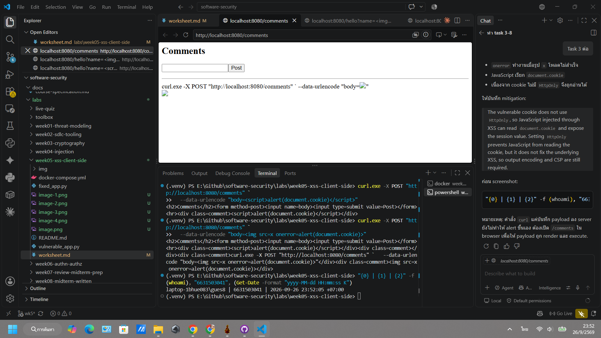
The vulnerable cookie does not use HttpOnly, so JavaScript injected through XSS can read document.cookie and expose the session value. Setting HttpOnly prevents JavaScript from reading the cookie, but it does not fix the underlying XSS, so output encoding and CSP are still required.

**Task 4 — CSRF PoC (30 min).**
- *Goal:* make a third-party page force a state-changing POST to `/comments`.
- *Steps:* create a local `csrf.html` with an auto-submitting form targeting the board (no token exists, cookie has no SameSite, so the browser attaches `session` cross-site):
  ```html
  <body onload="document.forms[0].submit()">
    <form action="http://localhost:8080/comments" method="POST">
      <input name="body" value="CSRF posted this comment">
    </form>
  </body>
  ```
  Open the file and confirm the comment appears on `/comments`.
- *Deliverable:* the HTML + screenshot of the forged comment + why `SameSite=Strict` blocks it.

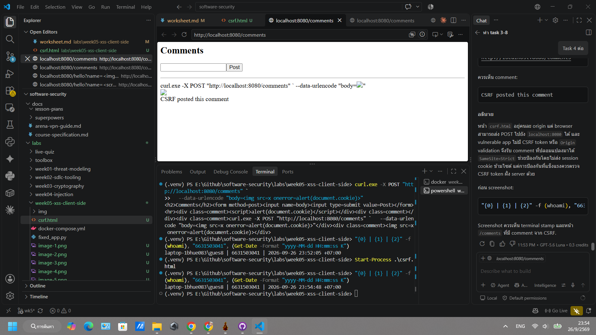

The `csrf.html` page resides on a different origin, yet the browser is able to send a POST request to `localhost:8080`. Since the vulnerable application lacks CSRF tokens or Origin validation, it accepts the forged comment. While `SameSite=Strict` offers protection by preventing the session cookie from being sent across sites, robust security requires server-side CSRF token validation as well.

```sim
xss-context
```

**Task 5 — Defend / fix it (30 min) 🛡️.**
- *Goal:* prove `fixed_app.py` blocks Tasks 1–3, then show that Task 4's CSRF PoC still gets through and explain why.
- *Steps:* stop the vulnerable container (`Ctrl-C`), then:
  ```bash
  docker compose run --rm --service-ports xss-lab bash -c "pip install --no-cache-dir flask && python fixed_app.py"
  ```
  Re-fire each payload. Expected: `/hello` renders the script **as text** (escape, L21), stored comments render literally (Jinja autoescape, L30–33), a strict CSP header is now present as defense-in-depth (`Content-Security-Policy: script-src 'self'`, L12 — check DevTools → Network → Response Headers; escaping already neutralizes these payloads, so no CSP *violation* fires in the console), and the cookie now has `HttpOnly; SameSite=Strict; Secure` (L42). Then re-run Task 4's `csrf.html` PoC against `fixed_app.py`: it **still posts the forged comment** — `/comments` (L25–28) never checks the `session` cookie or a CSRF token before accepting a POST, so hardening the cookie only stops the browser from *attaching* it cross-site; it doesn't stop the request itself from being processed.
- *Deliverable:* screenshots of escaped output + the CSP response header + the hardened cookie flags + the still-successful Task 4 forgery against `fixed_app.py`, with 2–3 sentences on why cookie hardening alone doesn't close CSRF here (no server-side check tied to the cookie, and no CSRF token).

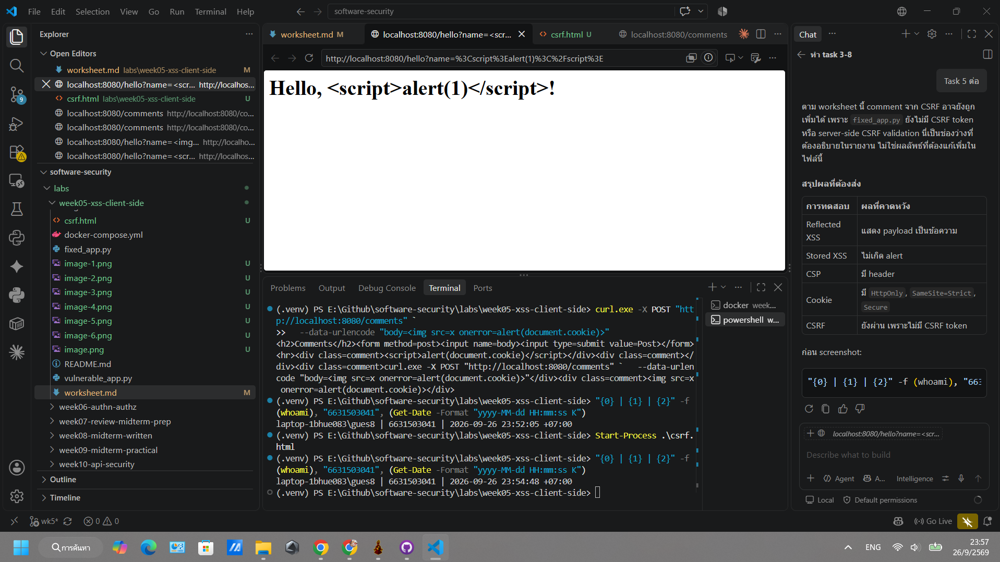
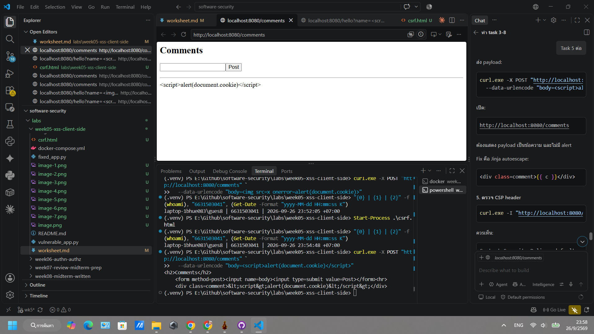
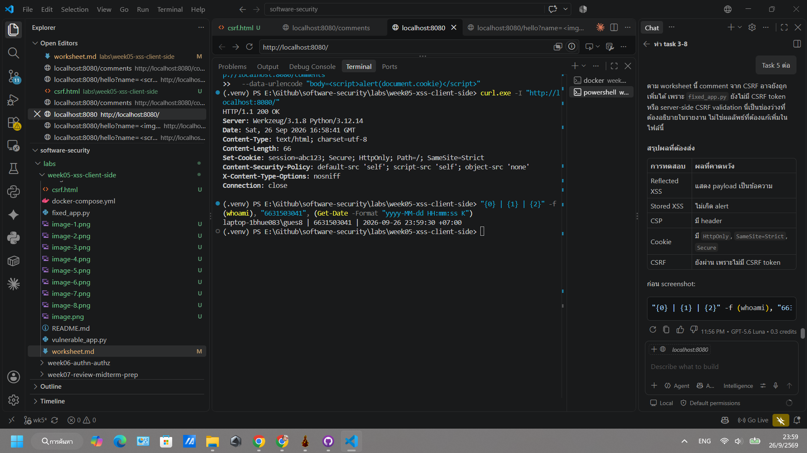
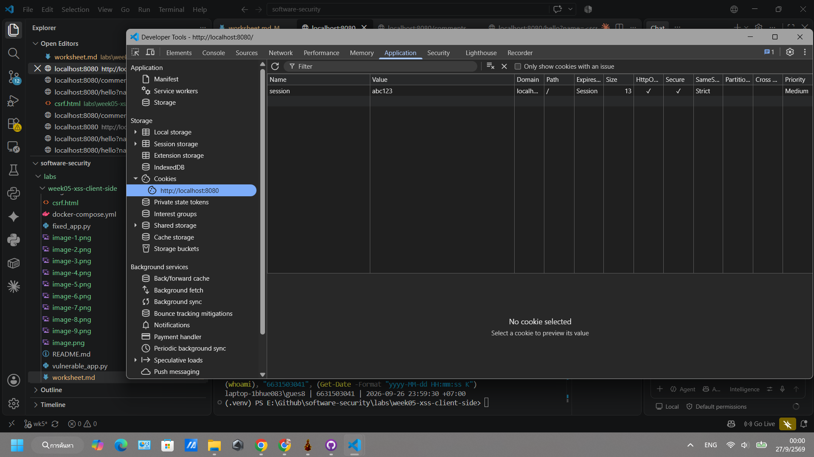
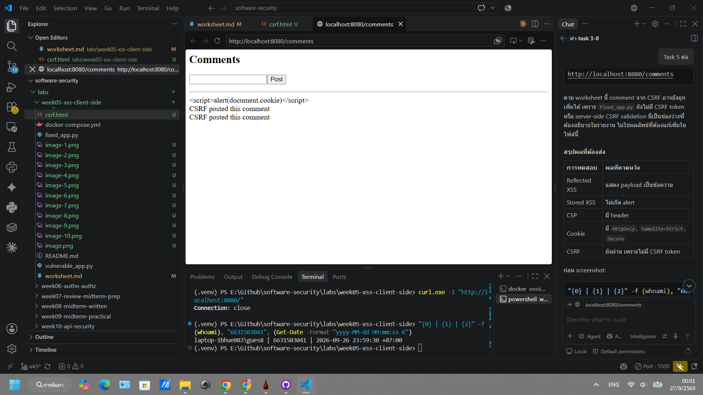

## Part 4 — Reflection

1. **CWE/OWASP mapping:** map your reflected/stored XSS to **CWE-79** and your CSRF PoC to **CWE-352**, both under OWASP 2025 **A05 Injection** (CSRF historically A01/A05).

Reflected and Stored XSS map directly to CWE-79 (Improper Neutralization of Input During Web Page Generation), while Cross-Site Request Forgery (CSRF) maps to CWE-352 (Cross-Site Request Forgery), with both vulnerability classes falling under the umbrella of OWASP Top 10 (2025) A05: Injection.

2. **Real breach:** the **2018 British Airways breach** (~380k payment records) used malicious JavaScript (Magecart) injected into the site to skim card data — a client-side script-injection failure. In 3–4 sentences relate it to this lab's XSS and CSP lessons.

The 2018 British Airways breach occurred when attackers injected malicious Magecart JavaScript into the airline's payment page, silently skimming the credit card details of roughly 380,000 customers. This perfectly mirrors the lab's XSS lessons, demonstrating the catastrophic impact of allowing untrusted, unverified JavaScript to execute within the victim's browser session. Furthermore, it underscores the critical necessity of a strict Content-Security-Policy (CSP); a properly configured CSP restricting script execution and network connections to known, trusted domains would have either blocked the rogue script from loading or prevented it from sending the stolen data to the attacker's drop server.

3. **Best mitigation:** between output encoding, a strict CSP, and HttpOnly+SameSite cookies, which gives the broadest defense-in-depth, and why is "encoding alone" still risky?

While combining HttpOnly and SameSite cookies neutralizes specific exploit paths (like session theft and CSRF), a strict Content-Security-Policy (CSP) provides the broadest defense-in-depth because it acts as a universal safety net that prevents malicious scripts from executing even if a vulnerability exists.

Relying on "encoding alone" is highly risky because it depends entirely on developer perfection. Output encoding requires the developer to manually apply the correct contextual escaping (HTML, JavaScript, or URL) at every single location where user input is rendered; missing just one variable or misunderstanding the rendering context completely invalidates the defense and leaves the application open to XSS.

## Grading rubric (100)

| Criterion | Points |
|-----------|-------:|
| Part 2 — Lecture questions (conceptual accuracy) | 20 |
| Part 3 — Exploitation + evidence (payloads + screenshots, Tasks 1–4) | 40 |
| Part 3 — Defense (Task 5: fixes proven, lines cited) | 25 |
| Part 4 — Reflection (CWE/OWASP mapping, breach, mitigation) | 15 |
| **Total** | **100** |

---

## Evidence & Integrity (required)

- **Identity proof:** every screenshot/diagram must show a terminal running `printf '%s | %s | ' "$(whoami)" '<YOUR-STUDENT-ID>'; date '+%F %T %Z'` **in the
  same image as the evidence**. When the evidence is a browser page, a DevTools panel or a
  rendered response, put that terminal **beside the browser and capture the whole screen** — a
  cropped window carries nothing that identifies you, and the lab's own output is
  byte-identical for the whole cohort *by design*, so the stamp is the only thing that makes
  the shot yours. Generic or borrowed evidence is not accepted.
- **Personalized flag (if this lab issues one):** ____________________
  *Flags are unique per student — submitting another student's flag is a violation. How to submit: **learn.zcr.ai/submit** (full guide: `SUBMISSION.md` in the repo root).*
- **Explain in your own words** *(graded on your reasoning, not copied text):*
  1. What did you do, and **why did the vulnerability work**?
  2. **Why does your fix actually stop it** — and what could still break it?

---

## 🤖 Audit the AI (required)

AI is a power tool you must **distrust** — you are graded on your *critique*, not the AI's answer.

1. Ask an AI assistant to exploit **or** fix this week's vulnerability. Paste its full answer.
2. **Find what's wrong or risky** in it — insecure code, a subtly incomplete fix, a hallucinated API/function/CVE, a missed edge case, or wrong reasoning. Quote the exact line(s).
3. Produce the **correct, verified** version yourself and explain in 2–3 sentences why the AI's output was insufficient.

> Disclose your AI use in the Part 1 table. This task counts toward your **Defense + Reflection** score.

---

## 🧠 Comprehension & Prompt (required)

**A. Explain in Plain English (EiPE).** In 2–3 sentences, in your own words, describe what this week's vulnerable code/endpoint actually *does* and *why it is exploitable* — explain the mechanism, don't dump jargon.

**B. Prompt Problem.** Write a **single prompt** that makes an AI produce a *correct, secure* fix for one finding. Run it: does the exploit now fail? If not, refine the prompt and try again. Submit the **final prompt + the verified result**.
*Graded on the prompt's precision and your verification — this trains problem decomposition and AI literacy (Denny et al. 2024).*
