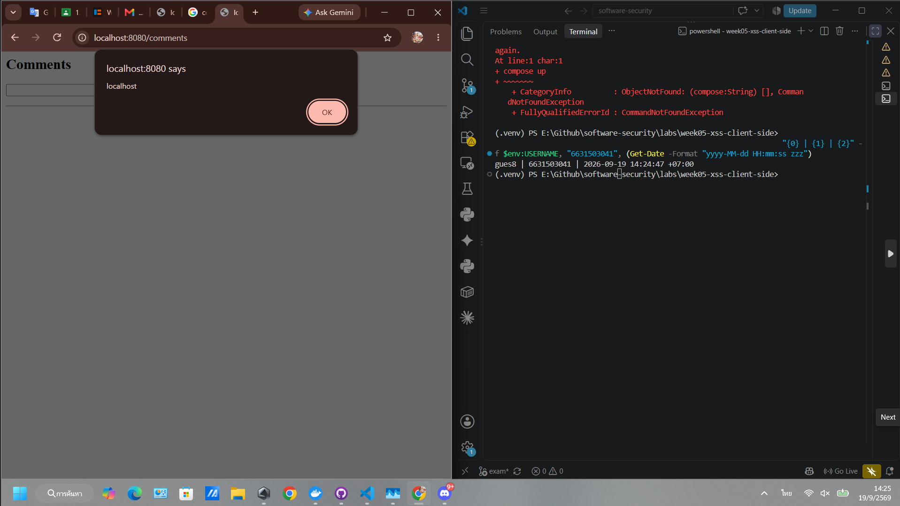
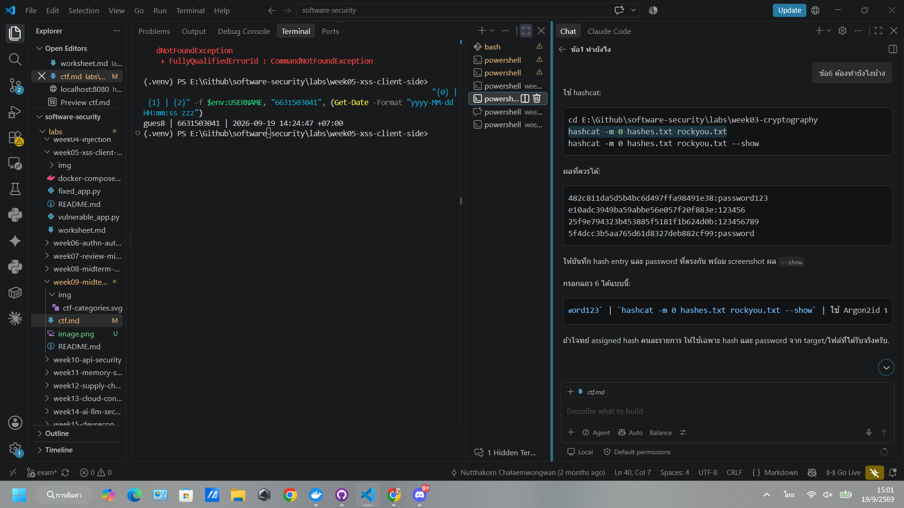
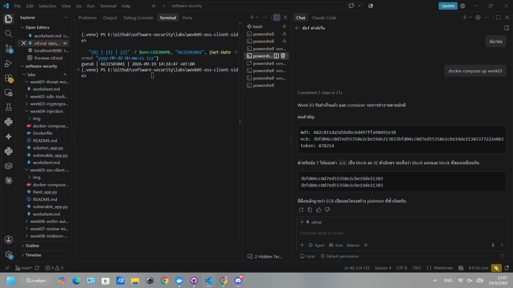

# Midterm — Hands-on CTF Practical (Week 9)

**Course:** Software Security (KOSEN69) · **Covers:** Weeks 1–6
**Time:** 150 min · **Total:** 100 pts · **Individual** · Sandbox targets only (ethics policy applies).

**Name:** Siravit Thakaew  **Student ID:** 6631503041

> Each challenge yields a **flag** in the form `FLAG{...}` (or the proof noted). Submit, per challenge: the **flag**, the **payload/command** you used, and a **one-line mitigation**. Partial credit for documented progress without the flag.

**Targets (started by the instructor):**
- Injection / Auth: `labs/week04-injection` and `labs/week06-authn-authz` apps (`docker compose up`)
- XSS: `labs/week05-xss-client-side` app
- Crypto: `labs/week03-cryptography` (`hashes.txt`, the ECB oracle)

---

## Challenges

| # | Title | Topic | Pts |
|---|-------|-------|-----|
| 1 | **Boolean Bypass** — log in as `admin` without the password | SQLi (W4) | 15 |
| 2 | **Shell Out** — read a file via the `host` parameter | Command injection (W4) | 15 |
| 3 | **Pop the Alert** — fire `alert(document.domain)` stored for another user | Stored XSS (W5) | 15 |
| 4 | **Not Your Order** — read another user's order object | IDOR (W6) | 15 |
| 5 | **Forge Ahead** — become admin with a forged JWT | Broken JWT (W6) | 15 |
| 6 | **Crack It** — recover a password from a weak hash | Crypto (W3) | 15 |
| 7 | **Penguin** — recover the plaintext structure from the ECB oracle | Crypto (W3) | 10 |

**Submission table (fill in):**

| # | Flag / proof | Payload or command | Mitigation (1 line) |
|---|---|---|---|
| 1 |`Welcome admin` (proof of successful admin login)|`/login?user=admin%27--&pw=x`|ใช้ parameterized query แทนการต่อค่า input เข้า SQL โดยตรง|
| 2 |`FLAG{sqli_demo}`|`host=127.0.0.1;cat /flag.txt`|ใช้ `subprocess` ด้วย `shell=False` และตรวจสอบ host ด้วย allow-list|
| 3 ||`` ผ่าน `POST /comments`|Escape/HTML-encode comment ก่อนแสดงผล และเปิดใช้ template auto-escaping|
| 4 |`FLAG{idor_demo}`, order `2`, owner `bob`|Login เป็น alice แล้วใช้ `GET /api/orders/2` พร้อม Alice JWT|ตรวจสอบว่า owner ของ order ตรงกับผู้ใช้ใน token ก่อนส่งข้อมูล|
| 5 | `FLAG{jwt_demo}` และ Alice token ได้ `403` | Unsigned JWT ที่มี `sub=admin` เรียก `GET /api/admin` | ตรวจลายเซ็น JWT ด้วย secret แบบสุ่มที่แข็งแรง ปิด alg:none และกำหนด algorithm ที่อนุญาต |
| 6 ||`hashcat -m 0 hashes.txt rockyou.txt --show`|ใช้ Argon2id หรือ bcrypt พร้อม unique salt แทน unsalted MD5|
| 7 ||`encrypt_ecb(b"A"*16 + b"A"*16)` จาก `vulnerable_crypto.py` | ใช้ AES-GCM หรือโหมด authenticated encryption ที่มี nonce และ authentication tag แทน ECB |

---

*Rules:* no collaboration; attack only the provided targets; document your steps. Pairs with the Week 8 written midterm.
